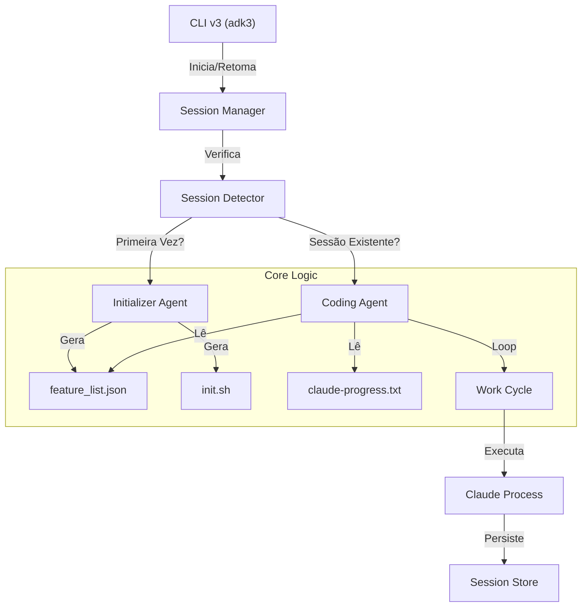

# Guia de Implementação ADK v3

**Data**: 02/02/2026
**Status**: PRONTO PARA EXECUÇÃO
**Contexto**: Migração para arquitetura de Agentes de Longa Duração (Long-Running Agents).

---

## 1. Visão Geral da Arquitetura v3

A versão 3 do ADK muda fundamentalmente como o CLI interage com o Claude. Em vez de comandos "one-shot" (executa e morre), passamos para um modelo de **Sessão Persistente** com dois tipos de agentes.

### 1.1 Diagrama de Componentes



---

## 2. Roteiro de Implementação Passo-a-Passo

### Fase 1: Fundação (Infrastructure)

#### 1.1 Session Store (`src/utils/session-store.ts`)

**Objetivo**: Gerenciar IDs de sessão do Claude para permitir retomada (`--resume`).

- **Responsabilidade**: Salvar e recuperar `sessionId` vinculado a uma feature.
- **Estrutura de Dados**:

  ```typescript
  interface SessionData {
    feature: string;
    sessionId: string;
    lastActive: string;
    status: 'active' | 'completed';
  }
  ```

- **Ação**: Criar arquivo novo.

#### 1.2 Claude v3 Execution (`src/utils/claude-v3.ts`)

**Objetivo**: Wrapper em torno do `claude` CLI que suporta sessões.

- **Diferença do v2**:
  - Aceita `sessionId` nas opções.
  - Se `sessionId` existir, passa flag `-p <sessionId>` (ou equivalente para resume).
  - Captura o Output para extrair o novo ID da sessão se for nova.
  - Usa `spawn` com `stdio: 'inherit'` mas monitora eventos de saída.

### Fase 2: Agentes (Prompts & Logic)

#### 2.1 Feature List Generator (`src/utils/feature-list.ts`)

**Objetivo**: Gerar o arquivo JSON que guia o Coding Agent.

- **Entrada**: PRD e Contexto.
- **Saída**: `feature_list.json` com testes/critérios de aceite.

#### 2.2 Initializer Agent (`src/utils/prompts/initializer.ts`)

**Prompt do Sistema**:

- "Você é um arquiteto de software configurando o ambiente..."
- **Missão**: Criar `init.sh`, `feature_list.json`, e commit inicial.
- **Output**: Arquivos físicos no disco.

#### 2.3 Coding Agent (`src/utils/prompts/coding.ts`)

**Prompt do Sistema**:

- "Você é um desenvolvedor sênior trabalhando em um loop contínuo..."
- **Regras**:
  1. Ler `feature_list.json`.
  2. Escolher a próxima task não passada.
  3. Implementar.
  4. Testar.
  5. Atualizar JSON.
  6. Commit.
- **Loop**: O prompt deve instruir o agente a NÃO parar até completar a lista ou encontrar erro bloqueante.

### Fase 3: Comandos CLI v3 (`src/commands/feature-v3.ts`)

#### 3.1 Comandos de Feature

> **Filosofia ADK**: Um comando por domínio, não um comando por etapa.

##### `adk feature <name>` (Interativo)

Modo com validações manuais entre cada fase.

##### `adk feature autopilot <name>` (Automático)

Modo automático com QA integrado por task.

**Lógica do Autopilot**:

1. Recebe `<name>` como argumento.
2. Detecta estado automaticamente:
   - **Não existe**: Cria estrutura → Initializer Agent
   - **Existe incompleto**: Resume de onde parou
3. **Fases com Validação Manual**:
   - Research → [Usuário: Refinar ou Seguir?]
   - Plan → [Usuário: Refinar ou Seguir?]
4. **Implement (Loop Automático com QA em 2 Camadas)**:

   ```text
   CAMADA 1 - QA por Task:
   Para cada Task:
     1. Implementa task
     2. Executa QA da task
     3. Se passou → próxima task
     4. Se falhou → cria correções → tenta novamente (max 3x)
     5. Se falhou 3x → PARA e pede ajuda ao usuário

   CAMADA 2 - QA Final:
   Após TODAS as tasks completas:
     1. Executa QA da feature completa
     2. Se passou → DONE
     3. Se falhou → cria correções → tenta novamente (max 3x)
     4. Se falhou 3x → PARA e pede ajuda ao usuário
   ```

5. **Escalonamento Inteligente**:
   - Tentativas de auto-correção: máximo 3 (por task e no QA final)
   - Se exceder: pausa e solicita intervenção humana
   - Contexto do problema é preservado para o usuário

**Importante**: NÃO há comandos separados como `feature new`, `feature research`, `feature implement`. Os comandos `adk feature <name>` e `adk feature autopilot <name>` fazem TUDO.

---

## 3. Reutilização de Código v2 (O que NÃO refazer)

Aproveite estritamente estes módulos do v2:

| Módulo v2 | Caminho | Uso no v3 |
|-----------|---------|-----------|
| **Progress Tracker** | `src/utils/progress.ts` | Manter atualização do `progress.md` como log de alto nível. |
| **Token Counter** | `src/utils/token-counter.ts` | Usar para monitorar custos. |
| **Context Compactor** | `src/utils/context-compactor.ts` | Usar quando contexto exceder limites (embora o Claude gerencie janela, a compactação ajuda a manter foco). |
| **Git Paths** | `src/utils/git-paths.ts` | Resolução de caminhos de worktrees. |

---

## 4. Detalhes Técnicos Críticos

### 4.1 Captura de Session ID

> **ATUALIZADO 2026-02-02**: Flags verificadas via `claude --help`

O Claude CLI expõe as seguintes flags para gerenciamento de sessão:

```bash
-r, --resume [value]     # Resume a conversation by session ID
--session-id <uuid>      # Use a specific session ID (must be valid UUID)
-c, --continue           # Continue most recent conversation in current dir
--fork-session           # Create new session ID when resuming
```

- **Estratégia para v3**:
  1. **Primeira execução**: Gerar UUID válido e passar via `--session-id <uuid>`
  2. **Execuções subsequentes**: Usar `--resume <uuid>` para retomar
  3. **Alternativa simples**: Usar `-c` (continue) por feature directory

### 4.2 Detecção de Término

Como saber se o Coding Agent acabou?

- **Sinal**: O agente deve escrever no `claude-progress.txt` ou atualizar `feature_list.json` com status "ALL PASSING".
- **Monitoramento**: O CLI v3 deve assistir esses arquivos (file watcher) ou verificar após o processo do Claude encerrar.

### 4.3 Tratamento de Erros

- Se `init.sh` falhar: Parar e pedir intervenção humana.
- Se testes falharem: O Coding Agent deve tentar corrigir (loop de auto-cura) até um limite de tentativas (ex: 3).

---

## 5. Próximos Passos (Checklist de Desenvolvimento)

1. [ ] **Scaffold**: Criar arquivos vazios definidos na Fase 1.
2. [ ] **Session Logic**: Implementar `SessionStore` e `ClaudeV3` wrapper.
3. [ ] **Prompts**: Criar templates de prompt para Initializer e Coding agents.
4. [ ] **CLI Wiring**: Conectar tudo no `src/commands/feature-v3.ts`.
5. [ ] **Test Drive**: Rodar `npm run adk3 -- feature work test-feature`.

---

## 6. Schema Consolidado: `feature_list.json`

> **CANONICAL**: Este é o schema oficial. Ignore versões anteriores em outros documentos.

```typescript
interface FeatureList {
  feature: string
  version: "1.0.0"
  created: string  // ISO 8601
  updated: string  // ISO 8601
  tests: FeatureTest[]
  summary: {
    total: number
    passing: number
    failing: number
    pending: number
  }
}

interface FeatureTest {
  id: string           // "test-001", "test-002", etc.
  description: string  // Human-readable test description
  category: "functional" | "ui" | "integration" | "api" | "performance"
  steps: string[]      // Ordered steps to verify
  status: "pending" | "passing" | "failing"
  files?: string[]     // Related source files
  lastTested?: string  // ISO 8601 timestamp
  evidence?: string    // Screenshot path or log excerpt
}
```

**Exemplo**:
```json
{
  "feature": "user-authentication",
  "version": "1.0.0",
  "created": "2026-02-02T10:00:00Z",
  "updated": "2026-02-02T14:30:00Z",
  "tests": [
    {
      "id": "test-001",
      "description": "User can login with valid credentials",
      "category": "functional",
      "steps": [
        "Navigate to /login",
        "Enter valid email and password",
        "Click submit button",
        "Verify redirect to /dashboard"
      ],
      "status": "pending",
      "files": ["src/auth/login.ts", "src/pages/login.tsx"]
    }
  ],
  "summary": {
    "total": 1,
    "passing": 0,
    "failing": 0,
    "pending": 1
  }
}
```

---

## 7. Plano de Migração de Features Existentes

### 7.1 Compatibilidade

O v3 deve coexistir com features v2 existentes:

| Artefato v2 | Ação no v3 |
|-------------|------------|
| `tasks.md` | **MANTER** - usado como fonte para gerar `feature_list.json` |
| `progress.md` | **MANTER** - continua como log de alto nível |
| `prd.md` | **MANTER** - entrada para Initializer Agent |
| `state.json` | **MANTER** - adicionar campos v3 |

### 7.2 Fluxo de Migração Automática

Quando `adk3 feature work <name>` é executado em feature v2:

```text
1. Detectar: feature_list.json existe?
   │
   ├─ NÃO → Iniciar Migração:
   │        a. Ler tasks.md existente
   │        b. Converter tasks para formato FeatureTest
   │        c. Gerar feature_list.json
   │        d. Criar init.sh baseado no projeto
   │        e. Executar Initializer Agent para validar/complementar
   │
   └─ SIM → Continuar com Coding Agent
```

### 7.3 Mapeamento tasks.md → feature_list.json

```typescript
// Conversão automática
function migrateTask(task: TaskFromMd): FeatureTest {
  return {
    id: `test-${task.index.toString().padStart(3, '0')}`,
    description: task.name,
    category: inferCategory(task.name),
    steps: task.subtasks || [task.name],
    status: task.status === 'completed' ? 'passing' : 'pending',
    files: task.files || []
  }
}
```

### 7.4 Rollback

Se migração falhar, features v2 continuam funcionando normalmente via `adk` (CLI v2).

---

## 8. Known Limitations

### 8.1 Limitações do Claude CLI

| Limitação | Impacto | Mitigação |
|-----------|---------|-----------|
| Session ID é UUID, não incremental | Difícil de ler/debugar | Usar alias em `sessions/` |
| `--continue` usa diretório, não feature | Conflito se múltiplas features no mesmo dir | Usar `--session-id` explícito |
| Sem evento "session created" no stream | Não sabemos quando sessão foi criada | Gerar UUID antes e passar via `--session-id` |

### 8.2 Limitações de Implementação v3

| Limitação | Descrição |
|-----------|-----------|
| Single feature per session | v3 não suporta trabalhar em múltiplas features simultaneamente |
| Sem browser automation nativo | Testes e2e dependem de Playwright MCP ou similar |
| Timeout fixo | Sessões longas podem ser interrompidas pelo OS |

### 8.3 Riscos Conhecidos

1. **API Instável**: Claude CLI pode mudar flags sem aviso prévio
2. **Rate Limits**: Sessões longas podem atingir limites de API
3. **Perda de Contexto**: Se processo morrer, sessão pode não ser recuperável mesmo com `--resume`

---

## 9. Diagrama de Estados da Sessão

```text
                    adk3 feature work
                           │
                           ▼
┌─────────────┐    ┌──────────────┐
│    IDLE     │───►│  DETECTING   │
└─────────────┘    └──────┬───────┘
                          │
            ┌─────────────┴─────────────┐
            │                           │
      No feature_list            Has feature_list
            │                           │
            ▼                           ▼
   ┌────────────────┐          ┌────────────────┐
   │  INITIALIZING  │          │    WORKING     │◄────┐
   └───────┬────────┘          └───────┬────────┘     │
           │                           │              │
     Files created              ┌──────┴──────┐       │
           │                    │             │       │
           ▼                    ▼             ▼       │
   ┌────────────────┐    Task done      Interrupt     │
   │    WORKING     │         │             │         │
   └────────────────┘         ▼             ▼         │
                        ┌──────────┐  ┌──────────┐    │
                        │COMMITTING│  │  PAUSED  │────┘
                        └────┬─────┘  └──────────┘
                             │
                    All tests passing?
                             │
                   ┌─────────┴─────────┐
                   │                   │
                  YES                  NO
                   │                   │
                   ▼                   │
            ┌──────────┐               │
            │ COMPLETED│               │
            └──────────┘               │
                                       │
                              Back to WORKING
```

---

*Este documento serve como a "Verdade Única" para a implementação da v3.*
*Última atualização: 2026-02-02*
