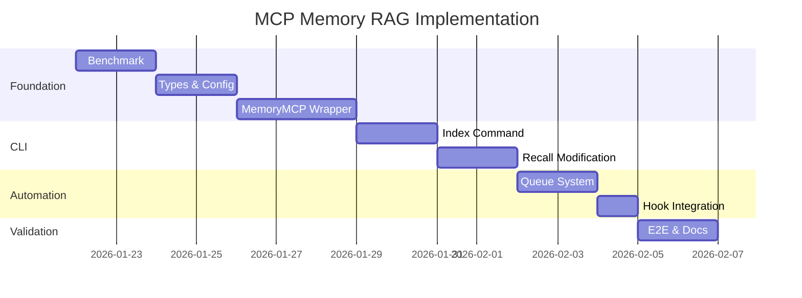

# Implementation Plan: adk-v2-fase1 (MCP Memory RAG)

**Data:** 2026-01-21
**Status:** Planning Complete
**Baseado em:** research.md, prd.md
**Estimativa Total:** 21 story points (~2-3 semanas)

---

## Visão Geral

Este plano detalha a implementação do MCP Memory RAG em **8 fases** seguindo TDD. Cada fase é independente e verificável, com critérios de aceite claros.

```
Fase 0: Benchmark (2 SP) ──► Fase 1: Types (2 SP) ──► Fase 2: Wrapper (5 SP)
                                                              │
                    ┌─────────────────────────────────────────┘
                    ▼
              Fase 3: Index CLI (3 SP) ──► Fase 4: Recall CLI (3 SP)
                                                    │
                    ┌───────────────────────────────┘
                    ▼
              Fase 5: Queue (2 SP) ──► Fase 6: Hook (2 SP) ──► Fase 7: E2E (2 SP)
```

---

## Fase 0: Benchmark de Providers MCP

### Objetivo
Avaliar e selecionar o provider MCP mais adequado para busca semântica, documentando a decisão.

### Story Points: 2

### Arquivos Envolvidos

| Tipo | Arquivo | Ação |
|------|---------|------|
| Output | `.claude/plans/features/adk-v2-fase1/mcp-benchmark.md` | Criar |

### Tarefas

1. **Preparar corpus de teste**
   - Coletar documentos de `.claude/plans/` (~6 features)
   - Coletar documentos de `.claude/memory/` (project-context)
   - Coletar documentos de `.claude/decisions/` (ADRs)
   - Total esperado: 20-50 documentos

2. **Testar @yikizi/mcp-local-rag**
   - Instalar e configurar localmente
   - Indexar corpus de teste
   - Executar queries de benchmark (10 queries)
   - Medir: response time p95, recall cross-language, memory usage

3. **Testar mcp-memory-service**
   - Instalar e configurar localmente
   - Indexar corpus de teste
   - Executar mesmas queries de benchmark
   - Medir: response time p95, recall cross-language, memory usage

4. **Documentar decisão**
   - Criar tabela comparativa
   - Justificar escolha
   - Documentar setup escolhido

### Queries de Benchmark (Corpus Bilíngue)

```markdown
1. "auth" → espera encontrar: autenticação, authentication, login, token
2. "user" → espera encontrar: usuário, account, profile
3. "test coverage" → espera encontrar: cobertura de testes, testing, TDD
4. "hook validation" → espera encontrar: validação, PreToolUse, PostToolUse
5. "session" → espera encontrar: sessão, checkpoint, resume
6. "deploy" → espera encontrar: implantação, deployment, production
7. "config" → espera encontrar: configuração, settings, environment
8. "memory" → espera encontrar: memória, context, recall
9. "workflow" → espera encontrar: fluxo de trabalho, pipeline, automation
10. "error handling" → espera encontrar: tratamento de erros, exception, fallback
```

### Critérios de Aceitação

- [ ] Benchmark documentado com métricas quantitativas
- [ ] Provider escolhido e justificado
- [ ] Setup funcional do provider escolhido
- [ ] Response time p95 < 100ms confirmado

### Dependências

- Nenhuma (fase inicial)

### Verificação

```bash
cat .claude/plans/features/adk-v2-fase1/mcp-benchmark.md | grep "Provider escolhido"
```

---

## Fase 1: Types & Configuração

### Objetivo
Criar sistema de tipos TypeScript e schema de configuração para MCP Memory.

### Story Points: 2

### Arquivos Envolvidos

| Tipo | Arquivo | Ação |
|------|---------|------|
| Types | `src/types/mcp-memory.ts` | Criar |
| Types Export | `src/types/index.ts` | Modificar |
| Config Template | `templates/claude-structure/adk/memory.json` | Criar |
| Tests | `tests/types/mcp-memory.test.ts` | Criar (TDD primeiro) |

### Tarefas

1. **Criar testes de tipos (TDD)**
   - Testes para validação de `MemoryDocument`
   - Testes para validação de `MemoryQuery`
   - Testes para validação de `MemoryResult`
   - Testes para validação de `MemoryConfig` via Zod

2. **Implementar tipos**
   ```typescript
   export interface MemoryDocument {
     id: string
     content: string
     metadata: MemoryDocumentMetadata
     embedding?: number[]
   }

   export interface MemoryDocumentMetadata {
     source: string
     title?: string
     createdAt: string
     updatedAt: string
     tags?: string[]
     feature?: string
   }

   export interface MemoryQuery {
     query: string
     options?: MemoryQueryOptions
   }

   export interface MemoryQueryOptions {
     limit?: number          // default: 5
     threshold?: number      // default: 0.65
     hybrid?: boolean        // default: true
     hybridWeights?: {
       semantic: number      // default: 0.7
       keyword: number       // default: 0.3
     }
   }

   export interface MemoryResult {
     documents: MemoryResultDocument[]
     timings: {
       total: number
       embedding?: number
       search?: number
       rerank?: number
     }
     meta: {
       provider: string
       query: string
       mode: 'semantic' | 'keyword' | 'hybrid'
     }
   }

   export interface MemoryResultDocument {
     id: string
     content: string
     score: number
     metadata: MemoryDocumentMetadata
   }
   ```

3. **Criar schema Zod para MemoryConfig**
   ```typescript
   export const MemoryConfigSchema = z.object({
     version: z.string().default('1.0.0'),
     provider: z.enum(['mcp-local-rag', 'mcp-memory-service']),
     storage: z.object({
       path: z.string().default('.adk/memory.db'),
       maxSize: z.string().default('500MB'),
     }),
     embedding: z.object({
       model: z.string().default('nomic-embed-text-v1.5'),
       chunkSize: z.number().default(512),
       overlap: z.number().default(100),
     }),
     retrieval: z.object({
       topK: z.number().default(10),
       finalK: z.number().default(5),
       threshold: z.number().default(0.65),
     }),
     hybridSearch: z.object({
       enabled: z.boolean().default(true),
       weights: z.object({
         semantic: z.number().default(0.7),
         keyword: z.number().default(0.3),
       }),
     }),
     indexPatterns: z.array(z.string()).default([
       '.claude/**/*.md',
       '.claude/**/*.txt',
     ]),
     ignorePatterns: z.array(z.string()).default([
       '**/.env*',
       '**/credentials*',
       '**/*.key',
       '**/*.pem',
       '**/secrets*',
     ]),
   })

   export type MemoryConfig = z.infer<typeof MemoryConfigSchema>
   ```

4. **Type guards**
   ```typescript
   export function isMemoryDocument(obj: unknown): obj is MemoryDocument
   export function isMemoryResult(obj: unknown): obj is MemoryResult
   ```

5. **Exportar em index.ts**

### Critérios de Aceitação

- [ ] `npm run type-check` passa sem erros
- [ ] Testes de tipos cobrem > 90% dos branches
- [ ] Schema Zod valida configuração corretamente
- [ ] Type guards funcionam para runtime validation
- [ ] Template de config gerado corretamente

### Dependências

- Fase 0 (provider escolhido define valores de config)

### Verificação

```bash
npm run type-check
npm test -- tests/types/mcp-memory.test.ts
```

---

## Fase 2: MemoryMCP Wrapper

### Objetivo
Implementar wrapper que abstrai comunicação com MCP server, com fallback para keyword search.

### Story Points: 5

### Arquivos Envolvidos

| Tipo | Arquivo | Ação |
|------|---------|------|
| Core | `src/utils/memory-mcp.ts` | Criar |
| Tests | `tests/utils/memory-mcp.test.ts` | Criar (TDD primeiro) |
| Config Loader | `src/utils/memory-config.ts` | Criar |
| Tests | `tests/utils/memory-config.test.ts` | Criar (TDD primeiro) |

### Tarefas

1. **Criar testes do wrapper (TDD)**
   - Testes de conexão com MCP server
   - Testes de `index()` com sucesso
   - Testes de `index()` com falha + retry
   - Testes de `recall()` com resultados
   - Testes de `recall()` sem resultados
   - Testes de fallback para keyword search
   - Testes de timeout handling
   - Testes de metrics logging

2. **Implementar MemoryMCP**
   ```typescript
   export class MemoryMCP {
     private config: MemoryConfig
     private client: MCPClient | null = null
     private connected: boolean = false

     constructor(config?: MemoryConfig)

     async connect(): Promise<boolean>
     async disconnect(): Promise<void>

     async index(
       content: string,
       metadata: Record<string, unknown>
     ): Promise<IndexResult>

     async recall(
       query: string,
       options?: MemoryQueryOptions
     ): Promise<MemoryResult>

     async archiveForCompaction(
       content: string,
       metadata: ArchiveMetadata
     ): Promise<string>

     async recoverArchived(archiveId: string): Promise<string>

     isConnected(): boolean
     getMetrics(): MemoryMetrics
   }
   ```

3. **Implementar fallback logic**
   ```typescript
   async recall(query: string, options?: MemoryQueryOptions): Promise<MemoryResult> {
     const startTime = Date.now()

     try {
       if (!this.connected) {
         await this.connect()
       }

       const result = await this.mcpRecall(query, options)
       return this.formatResult(result, 'semantic', startTime)

     } catch (error) {
       logger.warn(`MCP recall failed, falling back to keyword search: ${error}`)

       const keywordResults = await this.keywordFallback(query, options)
       return this.formatResult(keywordResults, 'keyword', startTime)
     }
   }
   ```

4. **Implementar config loader**
   ```typescript
   export async function loadMemoryConfig(): Promise<MemoryConfig>
   export async function saveMemoryConfig(config: MemoryConfig): Promise<void>
   export function getMemoryConfigPath(): string
   ```

5. **Implementar retry logic**
   - Max 3 retries
   - Exponential backoff (1s, 2s, 4s)
   - Timeout de 5s por operação

6. **Implementar verbose mode**
   - Log de timings por operação
   - Log de queries e resultados (quando DEBUG=true)

### Critérios de Aceitação

- [ ] Cobertura de testes >= 80%
- [ ] `index()` retorna `IndexResult` com ID do documento
- [ ] `recall()` retorna `MemoryResult` com documentos ordenados por score
- [ ] Fallback para keyword search funciona quando MCP falha
- [ ] Timeout de 5s é respeitado
- [ ] Retry com exponential backoff funciona
- [ ] Verbose mode loga métricas úteis

### Dependências

- Fase 1 (tipos)
- Fase 0 (provider para testar)

### Verificação

```bash
npm test -- tests/utils/memory-mcp.test.ts --coverage
npm test -- tests/utils/memory-config.test.ts
```

---

## Fase 3: CLI - Comando Index

### Objetivo
Implementar `adk memory index` para indexação manual de arquivos e diretórios.

### Story Points: 3

### Arquivos Envolvidos

| Tipo | Arquivo | Ação |
|------|---------|------|
| Command | `src/commands/memory.ts` | Modificar (+método `index()`) |
| CLI | `src/cli.ts` | Modificar (+subcomando `index`) |
| Tests | `tests/commands/memory-index.test.ts` | Criar (TDD primeiro) |

### Tarefas

1. **Criar testes do comando (TDD)**
   - Teste `--file` com arquivo válido
   - Teste `--file` com arquivo inexistente
   - Teste `--dir` com diretório válido
   - Teste `--dir` com diretório vazio
   - Teste `--filter` filtra extensões corretamente
   - Teste `--force` re-indexa arquivos já indexados
   - Teste skip de arquivos binários
   - Teste skip de arquivos sensíveis (.env)
   - Teste spinner com progresso
   - Teste resumo final

2. **Implementar método `index()` em MemoryCommand**
   ```typescript
   interface IndexOptions {
     file?: string
     dir?: string
     filter?: string    // ex: "*.md"
     force?: boolean
   }

   async index(options: IndexOptions): Promise<void> {
     const spinner = ora('Indexing...').start()

     try {
       const mcp = new MemoryMCP()
       await mcp.connect()

       const files = await this.collectFiles(options)
       const filtered = this.filterSensitive(files)

       let indexed = 0
       let skipped = 0

       for (const file of filtered) {
         spinner.text = `Indexing ${file}...`

         const alreadyIndexed = await this.isIndexed(file)
         if (alreadyIndexed && !options.force) {
           skipped++
           continue
         }

         const content = await fs.readFile(file, 'utf-8')
         const metadata = this.extractMetadata(file)

         await mcp.index(content, metadata)
         indexed++
       }

       spinner.succeed(`Indexed ${indexed} files (${skipped} skipped)`)

     } catch (error) {
       spinner.fail('Indexing failed')
       logger.error(error instanceof Error ? error.message : String(error))
       process.exit(1)
     }
   }
   ```

3. **Implementar helper `collectFiles()`**
   - Glob para `--dir`
   - Single file para `--file`
   - Apply `--filter` pattern

4. **Implementar helper `filterSensitive()`**
   - Usa `ignorePatterns` da config
   - Skip de binários por extension

5. **Registrar em cli.ts**
   ```typescript
   memory
     .command('index')
     .description('Index files for semantic search')
     .option('-f, --file <path>', 'Index single file')
     .option('-d, --dir <path>', 'Index all files in directory')
     .option('--filter <pattern>', 'Filter files by pattern (e.g., "*.md")')
     .option('--force', 'Re-index already indexed files')
     .action(async (options) => {
       await memoryCommand.index(options)
     })
   ```

### Critérios de Aceitação

- [ ] `adk memory index --file <path>` indexa arquivo único
- [ ] `adk memory index --dir .claude/` indexa diretório recursivamente
- [ ] `--filter "*.md"` filtra apenas markdown
- [ ] `--force` re-indexa arquivos já presentes
- [ ] Arquivos .env e credentials são ignorados
- [ ] Spinner mostra progresso
- [ ] Resumo final mostra contagem

### Dependências

- Fase 2 (MemoryMCP wrapper)

### Verificação

```bash
npm test -- tests/commands/memory-index.test.ts
adk memory index --dir .claude/ --filter "*.md"
```

---

## Fase 4: CLI - Modificação do Recall

### Objetivo
Modificar `adk memory recall` para usar busca semântica via MCP Memory como primary, com fallback.

### Story Points: 3

### Arquivos Envolvidos

| Tipo | Arquivo | Ação |
|------|---------|------|
| Command | `src/commands/memory.ts` | Modificar (método `recall()`) |
| CLI | `src/cli.ts` | Modificar (+opções do recall) |
| Tests | `tests/commands/memory-recall.test.ts` | Criar (TDD primeiro) |

### Tarefas

1. **Criar testes do comando modificado (TDD)**
   - Teste recall com MCP funcionando
   - Teste recall com MCP falha → fallback
   - Teste `--hybrid` ativa busca combinada
   - Teste `--limit` respeita número de resultados
   - Teste `--threshold` filtra por similarity
   - Teste output formatado com scores
   - Teste mensagem quando em fallback mode

2. **Modificar método `recall()` em MemoryCommand**
   ```typescript
   interface RecallOptions {
     hybrid?: boolean
     limit?: number       // default: 5
     threshold?: number   // default: 0.65
   }

   async recall(query: string, options: RecallOptions): Promise<void> {
     const spinner = ora('Searching...').start()

     try {
       const mcp = new MemoryMCP()
       const result = await mcp.recall(query, {
         limit: options.limit ?? 5,
         threshold: options.threshold ?? 0.65,
         hybrid: options.hybrid ?? true,
       })

       spinner.stop()

       if (result.documents.length === 0) {
         console.log(chalk.yellow('No results found'))
         return
       }

       if (result.meta.mode === 'keyword') {
         console.log(chalk.dim('(Using keyword search - MCP unavailable)'))
       }

       this.displayResults(result)

     } catch (error) {
       spinner.fail('Search failed')
       logger.error(error instanceof Error ? error.message : String(error))
       process.exit(1)
     }
   }
   ```

3. **Implementar `displayResults()`**
   ```typescript
   private displayResults(result: MemoryResult): void {
     console.log(chalk.bold(`\n${result.documents.length} results (${result.timings.total}ms)\n`))

     for (const doc of result.documents) {
       console.log(chalk.cyan(`━━━ ${doc.metadata.source} (${(doc.score * 100).toFixed(1)}%)`))
       console.log(this.truncateContent(doc.content, 200))
       console.log('')
     }
   }
   ```

4. **Atualizar opções em cli.ts**
   ```typescript
   memory
     .command('recall <query>')
     .description('Search memory using semantic search')
     .option('--hybrid', 'Use hybrid search (semantic + keyword)')
     .option('-l, --limit <n>', 'Number of results', '5')
     .option('-t, --threshold <n>', 'Similarity threshold (0-1)', '0.65')
     .action(async (query, options) => {
       await memoryCommand.recall(query, {
         hybrid: options.hybrid ?? true,
         limit: parseInt(options.limit),
         threshold: parseFloat(options.threshold),
       })
     })
   ```

### Critérios de Aceitação

- [ ] `adk memory recall "auth"` retorna documentos semanticamente relacionados
- [ ] Query cross-language funciona (auth → autenticação)
- [ ] `--hybrid` combina semantic + keyword
- [ ] `--limit 3` retorna exatamente 3 resultados
- [ ] `--threshold 0.8` filtra resultados baixa relevância
- [ ] Output mostra score de cada resultado
- [ ] Fallback para keyword funciona com mensagem clara

### Dependências

- Fase 2 (MemoryMCP wrapper)
- Fase 3 (dados indexados para testar)

### Verificação

```bash
npm test -- tests/commands/memory-recall.test.ts
adk memory recall "autenticação" --limit 5
adk memory recall "auth" --hybrid
```

---

## Fase 5: Sistema de Queue de Indexação

### Objetivo
Implementar fila assíncrona para indexação não-bloqueante via hooks.

### Story Points: 2

### Arquivos Envolvidos

| Tipo | Arquivo | Ação |
|------|---------|------|
| Core | `src/utils/memory-index-queue.ts` | Criar |
| Command | `src/commands/memory.ts` | Modificar (+métodos `queue()`, `processQueue()`) |
| CLI | `src/cli.ts` | Modificar (+subcomandos) |
| Tests | `tests/utils/memory-index-queue.test.ts` | Criar (TDD primeiro) |

### Tarefas

1. **Criar testes da queue (TDD)**
   - Teste `enqueue()` adiciona arquivo
   - Teste debounce agrupa múltiplas escritas
   - Teste `processQueue()` indexa arquivos pendentes
   - Teste persistência em `.adk/memory-queue.json`
   - Teste `getPendingCount()` retorna contagem correta
   - Teste arquivos duplicados são deduplicados

2. **Implementar MemoryIndexQueue**
   ```typescript
   interface QueueEntry {
     path: string
     addedAt: string
     attempts: number
   }

   export class MemoryIndexQueue {
     private queuePath: string
     private debounceTimers: Map<string, NodeJS.Timeout>
     private readonly DEBOUNCE_MS = 2000

     constructor(queuePath?: string)

     async enqueue(filePath: string): Promise<void> {
       const existing = this.debounceTimers.get(filePath)
       if (existing) {
         clearTimeout(existing)
       }

       const timer = setTimeout(async () => {
         await this.addToQueue(filePath)
         this.debounceTimers.delete(filePath)
       }, this.DEBOUNCE_MS)

       this.debounceTimers.set(filePath, timer)
     }

     async processQueue(batchSize?: number): Promise<ProcessResult> {
       const queue = await this.loadQueue()
       const mcp = new MemoryMCP()
       await mcp.connect()

       const toProcess = queue.slice(0, batchSize ?? 10)
       let processed = 0
       let failed = 0

       for (const entry of toProcess) {
         try {
           const content = await fs.readFile(entry.path, 'utf-8')
           await mcp.index(content, { source: entry.path })
           await this.removeFromQueue(entry.path)
           processed++
         } catch (error) {
           entry.attempts++
           if (entry.attempts >= 3) {
             await this.removeFromQueue(entry.path)
           }
           failed++
         }
       }

       return { processed, failed, remaining: queue.length - processed }
     }

     async getPendingCount(): Promise<number>
     async clearQueue(): Promise<void>
   }
   ```

3. **Adicionar métodos em MemoryCommand**
   ```typescript
   async queue(filePath: string): Promise<void> {
     const queue = new MemoryIndexQueue()
     await queue.enqueue(filePath)
     console.log(chalk.dim(`Queued for indexing: ${filePath}`))
   }

   async processQueue(options: { batchSize?: number }): Promise<void> {
     const spinner = ora('Processing index queue...').start()
     const queue = new MemoryIndexQueue()

     const result = await queue.processQueue(options.batchSize)

     spinner.succeed(
       `Processed ${result.processed} files ` +
       `(${result.failed} failed, ${result.remaining} remaining)`
     )
   }
   ```

4. **Registrar em cli.ts**
   ```typescript
   memory
     .command('queue <path>')
     .description('Queue file for async indexing')
     .action(async (path) => {
       await memoryCommand.queue(path)
     })

   memory
     .command('process-queue')
     .description('Process pending index queue')
     .option('-b, --batch-size <n>', 'Max files to process', '10')
     .action(async (options) => {
       await memoryCommand.processQueue({
         batchSize: parseInt(options.batchSize),
       })
     })
   ```

### Critérios de Aceitação

- [ ] `adk memory queue <path>` adiciona arquivo à fila
- [ ] Debounce de 2s agrupa múltiplas escritas ao mesmo arquivo
- [ ] `adk memory process-queue` processa fila
- [ ] Fila persiste em `.adk/memory-queue.json`
- [ ] Max 3 retries por arquivo
- [ ] `--batch-size` controla processamento

### Dependências

- Fase 2 (MemoryMCP wrapper)

### Verificação

```bash
npm test -- tests/utils/memory-index-queue.test.ts
adk memory queue .claude/test.md
adk memory process-queue --batch-size 5
```

---

## Fase 6: Hook de Indexação Automática

### Objetivo
Implementar hook que indexa automaticamente arquivos escritos em `.claude/*`.

### Story Points: 2

### Arquivos Envolvidos

| Tipo | Arquivo | Ação |
|------|---------|------|
| Hook | `.claude/hooks/post-write-index.sh` | Criar |
| Settings | `.claude/settings.json` | Modificar |
| Template | `templates/claude-structure/hooks/post-write-index.sh` | Criar |
| Tests | `tests/hooks/post-write-index.test.ts` | Criar |

### Tarefas

1. **Criar testes do hook**
   - Teste hook é executado em Write para .claude/*
   - Teste hook ignora arquivos fora de .claude/
   - Teste hook é assíncrono (não bloqueia)
   - Teste hook falha silenciosamente se ADK não disponível

2. **Implementar hook**
   ```bash
   #!/bin/bash

   FILE_PATH="$1"

   if [ -z "$FILE_PATH" ]; then
     exit 0
   fi

   if [[ ! "$FILE_PATH" == .claude/* ]]; then
     exit 0
   fi

   if [[ "$FILE_PATH" == *.json ]] || [[ "$FILE_PATH" == *.db ]]; then
     exit 0
   fi

   if command -v adk &> /dev/null; then
     adk memory queue "$FILE_PATH" &
   fi

   exit 0
   ```

3. **Atualizar settings.json**
   ```json
   "PostToolUse": [
     {
       "matcher": "Write",
       "hooks": [
         { "type": "command", "command": ".claude/hooks/post-write.sh" },
         { "type": "command", "command": ".claude/hooks/sync-state.sh" },
         { "type": "command", "command": ".claude/hooks/post-write-index.sh" }
       ]
     }
   ]
   ```

4. **Adicionar ao template init**
   - Copiar hook para `templates/claude-structure/hooks/`
   - Atualizar `copyClaudeStructure()` para incluir novo hook

### Critérios de Aceitação

- [ ] Hook executa em PostToolUse:Write
- [ ] Arquivos em `.claude/*` são enfileirados
- [ ] Arquivos fora de `.claude/` são ignorados
- [ ] Hook é assíncrono (usa `&`)
- [ ] Falha silenciosamente se adk indisponível
- [ ] Hook incluído em novos projetos via init

### Dependências

- Fase 5 (sistema de queue)

### Verificação

```bash
chmod +x .claude/hooks/post-write-index.sh
echo "test" > .claude/test-index.md
cat .adk/memory-queue.json
```

---

## Fase 7: Testes E2E e Documentação

### Objetivo
Validar integração completa do sistema e documentar uso.

### Story Points: 2

### Arquivos Envolvidos

| Tipo | Arquivo | Ação |
|------|---------|------|
| Tests | `tests/integration/memory-e2e.test.ts` | Criar |
| Docs | `CLAUDE.md` | Modificar (+seção MCP Memory) |

### Tarefas

1. **Criar testes E2E**
   ```typescript
   describe('MCP Memory E2E', () => {
     beforeAll(async () => {
       await execAsync('adk memory index --dir .claude/plans/features/adk-v2-fase1/')
     })

     it('indexes and recalls cross-language', async () => {
       const result = await execAsync('adk memory recall "autenticação" --limit 3')
       expect(result.stdout).toContain('authentication')
       expect(result.stdout).toContain('auth')
     })

     it('hook triggers indexing', async () => {
       await fs.writeFile('.claude/test-e2e.md', '# Test Document\nContent about testing.')
       await sleep(3000)

       const queue = await fs.readJson('.adk/memory-queue.json')
       expect(queue).toContainEqual(
         expect.objectContaining({ path: '.claude/test-e2e.md' })
       )

       await execAsync('adk memory process-queue')

       const result = await execAsync('adk memory recall "Test Document"')
       expect(result.stdout).toContain('test-e2e.md')
     })

     it('fallback works when MCP unavailable', async () => {
       const result = await execAsync('adk memory recall "something" --no-mcp')
       expect(result.stdout).toContain('keyword search')
     })
   })
   ```

2. **Documentar em CLAUDE.md**
   ```markdown
   ## MCP Memory RAG

   O ADK inclui sistema de busca semântica via MCP Memory para recuperação
   de contexto cross-language.

   ### Setup Inicial

   \`\`\`bash
   adk memory index --dir .claude/
   \`\`\`

   ### Comandos

   | Comando | Descrição |
   |---------|-----------|
   | `adk memory index --file <path>` | Indexa arquivo único |
   | `adk memory index --dir <path>` | Indexa diretório |
   | `adk memory recall <query>` | Busca semântica |
   | `adk memory recall <query> --hybrid` | Busca híbrida |
   | `adk memory process-queue` | Processa fila pendente |

   ### Configuração

   Configuração em `.adk/memory.json`:

   \`\`\`json
   {
     "provider": "mcp-local-rag",
     "retrieval": {
       "topK": 10,
       "threshold": 0.65
     },
     "hybridSearch": {
       "enabled": true,
       "weights": { "semantic": 0.7, "keyword": 0.3 }
     }
   }
   \`\`\`

   ### Troubleshooting

   **MCP server não responde:**
   - Verificar se server está rodando
   - Fallback automático para keyword search

   **Resultados ruins:**
   - Verificar se arquivos foram indexados: `adk memory index --dir .claude/ --force`
   - Ajustar threshold: `--threshold 0.5`
   ```

3. **Validar cobertura total**
   ```bash
   npm run test:coverage
   ```

### Critérios de Aceitação

- [ ] E2E: index → recall funciona end-to-end
- [ ] E2E: hook → queue → process → recall funciona
- [ ] E2E: fallback para keyword testado
- [ ] Cobertura total >= 80%
- [ ] CLAUDE.md documentado com exemplos
- [ ] Troubleshooting guide presente

### Dependências

- Todas as fases anteriores (0-6)

### Verificação

```bash
npm test -- tests/integration/memory-e2e.test.ts
npm run test:coverage
grep "MCP Memory" CLAUDE.md
```

---

## Resumo de Story Points

| Fase | Objetivo | SP | Acumulado |
|------|----------|-----|-----------|
| 0 | Benchmark | 2 | 2 |
| 1 | Types & Config | 2 | 4 |
| 2 | MemoryMCP Wrapper | 5 | 9 |
| 3 | CLI Index | 3 | 12 |
| 4 | CLI Recall | 3 | 15 |
| 5 | Queue System | 2 | 17 |
| 6 | Hook | 2 | 19 |
| 7 | E2E & Docs | 2 | 21 |

**Total: 21 SP**

---

## Checkpoints de Verificação

### Checkpoint 1: Após Fase 2 (9 SP)
- [ ] Provider escolhido e funcionando
- [ ] Types compilando
- [ ] Wrapper testado com fallback
- **Go/No-Go:** Se p95 > 100ms, reavaliar provider

### Checkpoint 2: Após Fase 4 (15 SP)
- [ ] `adk memory index` funcional
- [ ] `adk memory recall` retorna resultados semânticos
- **Go/No-Go:** Se recall cross-language < 60%, ajustar weights

### Checkpoint 3: Após Fase 7 (21 SP)
- [ ] E2E passando
- [ ] Cobertura >= 80%
- [ ] Documentação completa
- **Go/No-Go:** Ready for merge

---

## Estratégia de Testes

### Pirâmide de Testes

```
        /\
       /  \        E2E (10%)
      /----\       - memory-e2e.test.ts
     /      \
    /--------\     Integration (30%)
   /          \    - Command tests
  /------------\   - Hook tests
 /              \
/----------------\ Unit (60%)
                   - memory-mcp.test.ts
                   - memory-index-queue.test.ts
                   - mcp-memory types
```

### Cobertura Esperada por Módulo

| Módulo | Target |
|--------|--------|
| `src/types/mcp-memory.ts` | 100% |
| `src/utils/memory-mcp.ts` | >= 80% |
| `src/utils/memory-config.ts` | >= 80% |
| `src/utils/memory-index-queue.ts` | >= 80% |
| `src/commands/memory.ts` (novos métodos) | >= 80% |

### Mocking Strategy

- **MCP Server:** Mock responses para testes unitários
- **File System:** Mock fs-extra para testes de queue
- **Time:** Jest fake timers para debounce tests

---

## Ordem Ótima de Implementação



---

## Critérios de Sucesso Geral

### Métricas Técnicas (Obrigatórias)

- [ ] Recall cross-language >= 80% (baseline: 20%)
- [ ] Precision top-5 >= 85%
- [ ] Response time p95 < 100ms
- [ ] Cobertura de testes >= 80%
- [ ] Zero breaking changes em funcionalidade existente

### Métricas de Qualidade (Desejáveis)

- [ ] Nenhum arquivo sensível indexado em testes
- [ ] Fallback funciona 100% do tempo
- [ ] Documentação clara e completa
- [ ] Hook não adiciona latência perceptível

---

**Documento criado em:** 2026-01-21
**Próxima fase:** Implementation (começar pela Fase 0: Benchmark)
**Blocker para implementation:** Nenhum - plano completo

---

## Apêndice: Checklist de Implementação

Use este checklist durante a implementação:

### Fase 0
- [ ] Corpus de teste preparado
- [ ] @yikizi/mcp-local-rag testado
- [ ] mcp-memory-service testado
- [ ] mcp-benchmark.md criado
- [ ] Provider escolhido

### Fase 1
- [ ] tests/types/mcp-memory.test.ts criado
- [ ] src/types/mcp-memory.ts implementado
- [ ] src/types/index.ts atualizado
- [ ] templates/claude-structure/adk/memory.json criado
- [ ] npm run type-check passa

### Fase 2
- [ ] tests/utils/memory-config.test.ts criado
- [ ] src/utils/memory-config.ts implementado
- [ ] tests/utils/memory-mcp.test.ts criado
- [ ] src/utils/memory-mcp.ts implementado
- [ ] Cobertura >= 80%

### Fase 3
- [ ] tests/commands/memory-index.test.ts criado
- [ ] Método index() implementado
- [ ] CLI registrado
- [ ] adk memory index funciona

### Fase 4
- [ ] tests/commands/memory-recall.test.ts criado
- [ ] Método recall() modificado
- [ ] Opções CLI atualizadas
- [ ] adk memory recall funciona semanticamente

### Fase 5
- [ ] tests/utils/memory-index-queue.test.ts criado
- [ ] src/utils/memory-index-queue.ts implementado
- [ ] Métodos queue() e processQueue() adicionados
- [ ] CLI registrado

### Fase 6
- [ ] .claude/hooks/post-write-index.sh criado
- [ ] .claude/settings.json atualizado
- [ ] Template adicionado
- [ ] Hook funciona assincronamente

### Fase 7
- [ ] tests/integration/memory-e2e.test.ts criado
- [ ] Todos E2E passando
- [ ] CLAUDE.md atualizado
- [ ] Cobertura total >= 80%
