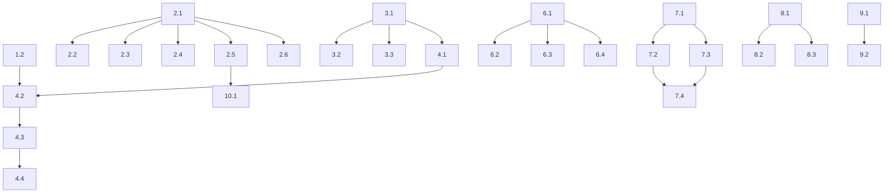

# Tasks: v3-version

**Complexidade:** Épico
**Total de Tasks:** 45 (target: 30-60 baseado na complexidade)
**Última Atualização:** 2026-02-02

---

## Fase 1: Infraestrutura Base

### Task 1.1: Expandir CLI v3 com comandos feature e autopilot

**Tipo:** Feature
**Estimativa:** M (2-4h)
**Dependências:** nenhuma

#### Escopo
- O que FAZER:
  - Adicionar comando `adk3 feature <name>` no CLI
  - Adicionar comando `adk3 feature autopilot <name>`
  - Adicionar flags `--resume`, `--parallel`, `--agents <n>`
  - Implementar roteamento para FeatureV3Command
- O que NÃO FAZER:
  - Implementar lógica interna dos comandos (será em tasks separadas)
  - Modificar cli.ts (v2)

#### Critérios de Aceite
- [x] `adk3 feature <name>` é reconhecido e chama FeatureV3Command.feature()
- [x] `adk3 feature autopilot <name>` é reconhecido e chama FeatureV3Command.autopilot()
- [x] Flags --resume, --parallel, --agents funcionam
- [x] Testes unitários passam

#### Arquivos Envolvidos
- `src/cli-v3.ts` - modificar
- `tests/cli-v3.test.ts` - modificar

---

### Task 1.2: Implementar claude-v3.ts com suporte a sessões

**Tipo:** Feature
**Estimativa:** G (4-8h)
**Dependências:** nenhuma

#### Escopo
- O que FAZER:
  - Expandir executeWithSessionTracking para usar --session-id e --resume
  - Implementar geração de UUID válido para sessões
  - Capturar métricas de execução (tokens, duração)
  - Implementar continuação com -c flag
- O que NÃO FAZER:
  - Modificar claude.ts (v2)

#### Critérios de Aceite
- [x] Nova sessão criada com UUID válido via --session-id
- [x] Sessão existente retomada via --resume
- [x] Métricas de execução capturadas (tokens, duração)
- [x] Testes com mocks passam

#### Arquivos Envolvidos
- `src/utils/claude-v3.ts` - modificar
- `tests/utils/claude-v3.test.ts` - modificar

---

### Task 1.3: Validar flags Claude CLI e implementar fallbacks

**Tipo:** Feature
**Estimativa:** P (1-2h)
**Dependências:** 1.2

#### Escopo
- O que FAZER:
  - Criar função para detectar flags disponíveis no Claude CLI
  - Implementar fallback se --session-id não disponível
  - Documentar limitações conhecidas
- O que NÃO FAZER:
  - Modificar comportamento do Claude CLI

#### Critérios de Aceite
- [x] Função detectClaudeCapabilities() retorna flags disponíveis
- [x] Sistema funciona mesmo se flags não disponíveis
- [x] Log de warning quando usando fallback
- [x] Testes passam

#### Arquivos Envolvidos
- `src/utils/claude-v3.ts` - modificar

---

## Fase 2: Sistema de Memória (4 Tiers)

### Task 2.1: Implementar Tier 1 - Core State Manager

**Tipo:** Feature
**Estimativa:** G (4-8h)
**Dependências:** nenhuma

#### Escopo
- O que FAZER:
  - Criar CoreStateManager classe
  - Implementar schema JSON do core-state.json
  - CRUD: load, save, update, clear
  - Validação com Zod
  - Limitar a 2000 tokens (auto-compactação interna)
- O que NÃO FAZER:
  - Implementar outros tiers
  - Integrar com comandos (será em task separada)

#### Critérios de Aceite
- [x] Schema core-state.json implementado e validado com Zod
- [x] CoreStateManager.load() carrega ou cria estado
- [x] CoreStateManager.update() atualiza campos específicos
- [x] CoreStateManager.addDecision() mantém max 5 decisões
- [x] CoreStateManager.addModifiedFile() rastreia arquivos
- [x] Auto-compactação quando excede 2000 tokens
- [x] Testes unitários com >80% cobertura

#### Arquivos Envolvidos
- `src/utils/memory/core-state.ts` - criado
- `src/types/core-state.ts` - criado
- `tests/utils/memory/core-state.test.ts` - criado

---

### Task 2.2: Implementar Tier 2 - Session Notes Manager

**Tipo:** Feature
**Estimativa:** M (2-4h)
**Dependências:** 2.1

#### Escopo
- O que FAZER:
  - Criar SessionNotesManager classe
  - Gerar session-notes.md automaticamente
  - Adicionar entries na timeline
  - Registrar learnings e files read
- O que NÃO FAZER:
  - Implementar outros tiers

#### Critérios de Aceite
- [x] session-notes.md criado com template correto
- [x] Timeline atualizada automaticamente
- [x] Seção "Key Learnings" populada
- [x] Seção "Files Read" rastreada
- [x] Testes unitários passam

#### Arquivos Envolvidos
- `src/utils/memory/session-notes.ts` - criar
- `tests/utils/memory/session-notes.test.ts` - criar

---

### Task 2.3: Implementar Tier 2 - Decisions Manager

**Tipo:** Feature
**Estimativa:** M (2-4h)
**Dependências:** 2.1

#### Escopo
- O que FAZER:
  - Criar DecisionsManager classe
  - Gerar decisions.md com template ADR
  - Adicionar decisões com context, options, rationale
- O que NÃO FAZER:
  - Implementar auto-captura (será em task separada)

#### Critérios de Aceite
- [x] decisions.md criado com template ADR
- [x] Decisões adicionadas com ID sequencial
- [x] Todas as seções populadas (context, options, decision, rationale, consequences)
- [x] Testes unitários passam

#### Arquivos Envolvidos
- `src/utils/memory/decisions.ts` - criado
- `tests/utils/memory/decisions.test.ts` - criado

---

### Task 2.4: Implementar Tier 2 - Breadcrumbs Manager

**Tipo:** Feature
**Estimativa:** P (1-2h)
**Dependências:** 2.1

#### Escopo
- O que FAZER:
  - Criar BreadcrumbsManager classe
  - Gerar breadcrumbs.md para referências rápidas
  - Adicionar patterns, arquivos importantes, comandos
- O que NÃO FAZER:
  - Implementar busca semântica

#### Critérios de Aceite
- [x] breadcrumbs.md criado com seções organizadas
- [x] Patterns adicionados com localização
- [x] Arquivos importantes com notas
- [x] Comandos que funcionaram registrados
- [x] Testes unitários passam

#### Arquivos Envolvidos
- `src/utils/memory/breadcrumbs.ts` - criar
- `tests/utils/memory/breadcrumbs.test.ts` - criar

---

### Task 2.5: Implementar Memory Loader com Progressive Loading

**Tipo:** Feature
**Estimativa:** G (4-8h)
**Dependências:** 2.1, 2.2, 2.3, 2.4

#### Escopo
- O que FAZER:
  - Criar MemoryLoader classe
  - Implementar loading por fase (research, plan, implement, qa)
  - Carregar Tier 1 sempre, Tier 2 por sessão, Tier 3 on-demand
  - Respeitar limite de 20K tokens por carregamento
- O que NÃO FAZER:
  - Implementar Tier 4 (project context)

#### Critérios de Aceite
- [~] MemoryLoader.loadForPhase() carrega contexto correto
- [x] Tier 1 sempre incluso
- [x] Tier 2 incluso quando sessão ativa
- [x] Tier 3 carregado sob demanda
- [x] Limite de 20K tokens respeitado
- [x] Testes unitários passam

#### Arquivos Envolvidos
- `src/utils/memory/loader.ts` - criar
- `tests/utils/memory/loader.test.ts` - criar

---

### Task 2.6: Implementar Two-Threshold Compaction

**Tipo:** Feature
**Estimativa:** G (4-8h)
**Dependências:** 2.1, 2.5

#### Escopo
- O que FAZER:
  - Criar CompactorV3 classe (separado do v2)
  - Implementar threshold duplo (80% trigger, 50% target)
  - Preservar info crítica (paths, line numbers, nomes, comandos, erros)
  - Comprimir redundâncias e outputs processados
  - Template de COMPACTED_STATE.md
- O que NÃO FAZER:
  - Modificar context-compactor.ts (v2)

#### Critérios de Aceite
- [ ] Compactação dispara em 80% de uso
- [ ] Contexto reduzido para ~50% após compactação
- [ ] Paths, line numbers, nomes preservados
- [ ] Explicações redundantes removidas
- [ ] COMPACTED_STATE.md gerado corretamente
- [x] Testes unitários passam

#### Arquivos Envolvidos
- `src/utils/memory/compactor.ts` - criar
- `tests/utils/memory/compactor.test.ts` - criar

---

## Fase 3: Lógica de Agentes

### Task 3.1: Implementar feature_list.json Schema e Operations

**Tipo:** Feature
**Estimativa:** M (2-4h)
**Dependências:** nenhuma

#### Escopo
- O que FAZER:
  - Definir schema FeatureList e FeatureTest com Zod
  - Criar FeatureListManager classe
  - CRUD: create, load, update, getNextPending
  - Migração de tasks.md para feature_list.json
- O que NÃO FAZER:
  - Gerar lista automaticamente (será pelo Initializer Agent)

#### Critérios de Aceite
- [x] Schema FeatureList validado com Zod
- [x] FeatureListManager.create() cria arquivo vazio
- [x] FeatureListManager.load() carrega e valida
- [x] FeatureListManager.updateTestStatus() atualiza status
- [x] FeatureListManager.getNextPending() retorna próximo teste
- [x] Migração de tasks.md funciona
- [x] Testes unitários passam

#### Arquivos Envolvidos
- `src/utils/feature-list.ts` - criado
- `src/types/feature-list.ts` - criado
- `tests/utils/feature-list.test.ts` - criado

---

### Task 3.2: Implementar Initializer Agent Prompt Builder

**Tipo:** Feature
**Estimativa:** G (4-8h)
**Dependências:** 3.1, 2.1

#### Escopo
- O que FAZER:
  - Criar InitializerPromptBuilder classe
  - Gerar prompt do sistema para Initializer Agent
  - Incluir anti-stub rules, read-before-write protocol
  - Instruir geração de feature_list.json e init.sh
- O que NÃO FAZER:
  - Executar o agente (será no comando feature)

#### Critérios de Aceite
- [x] Prompt do sistema inclui missão clara
- [x] Anti-stub rules presentes no prompt
- [x] Read-before-write protocol incluso
- [x] Instruções para gerar feature_list.json
- [x] Instruções para gerar init.sh
- [x] Testes unitários passam

#### Arquivos Envolvidos
- `src/utils/prompts/initializer.ts` - criar
- `tests/utils/prompts/initializer.test.ts` - criar

---

### Task 3.3: Implementar Coding Agent Prompt Builder

**Tipo:** Feature
**Estimativa:** G (4-8h)
**Dependências:** 3.1, 2.1

#### Escopo
- O que FAZER:
  - Criar CodingPromptBuilder classe
  - Gerar prompt do sistema para Coding Agent
  - Loop: Read State → Select Task → Implement (TDD) → Update → Commit
  - Incluir anti-stub rules, verification checklist
  - Incluir comprehension checkpoint
- O que NÃO FAZER:
  - Executar o agente (será no comando feature)

#### Critérios de Aceite
- [x] Prompt do sistema inclui loop de trabalho
- [x] Anti-stub rules presentes (5 camadas)
- [x] TDD enforcement incluso
- [x] Verification checklist presente
- [x] Comprehension checkpoint incluso
- [x] Testes unitários passam

#### Arquivos Envolvidos
- `src/utils/prompts/coding.ts` - criado
- `tests/utils/prompts/coding.test.ts` - criado

---

## Fase 4: Comandos Feature v3

### Task 4.1: Implementar feature-v3.ts método feature() - Detecção de Estado

**Tipo:** Feature
**Estimativa:** M (2-4h)
**Dependências:** 2.1, 3.1

#### Escopo
- O que FAZER:
  - Implementar detecção automática de estado da feature
  - Determinar se precisa Initializer ou Coding Agent
  - Carregar contexto apropriado baseado no estado
- O que NÃO FAZER:
  - Implementar execução das fases (próximas tasks)

#### Critérios de Aceite
- [ ] Detecta feature inexistente → cria estrutura
- [ ] Detecta sem feature_list.json → Initializer Agent
- [ ] Detecta com feature_list.json → Coding Agent
- [ ] Estado carregado corretamente
- [x] Testes unitários passam

#### Arquivos Envolvidos
- `src/commands/feature-v3.ts` - modificar
- `tests/commands/feature-v3.test.ts` - modificar

---

### Task 4.2: Implementar feature-v3.ts método feature() - Fluxo Interativo

**Tipo:** Feature
**Estimativa:** G (4-8h)
**Dependências:** 4.1, 3.2, 3.3, 1.2

#### Escopo
- O que FAZER:
  - Implementar fluxo Research → [Manual] → Plan → [Manual] → Implement
  - Validação manual entre fases (prompt interativo)
  - Integrar com claude-v3 para execução
  - Salvar sessão após cada fase
- O que NÃO FAZER:
  - Implementar modo autopilot (próxima task)

#### Critérios de Aceite
- [ ] Research executa e aguarda validação
- [ ] Plan executa após aprovação e aguarda validação
- [ ] Implement inicia após aprovação
- [ ] Sessão salva entre fases
- [ ] Usuário pode sair e retomar
- [x] Testes unitários passam

#### Arquivos Envolvidos
- `src/commands/feature-v3.ts` - modificar
- `tests/commands/feature-v3.test.ts` - modificar

---

### Task 4.3: Implementar feature-v3.ts método autopilot() - QA por Task

**Tipo:** Feature
**Estimativa:** G (4-8h)
**Dependências:** 4.2

#### Escopo
- O que FAZER:
  - Implementar loop automático de implementação
  - QA por task com auto-correção (max 3x)
  - Escalação para humano quando excede tentativas
  - Atualizar feature_list.json após cada task
- O que NÃO FAZER:
  - Implementar QA final (próxima task)

#### Critérios de Aceite
- [ ] Loop executa tasks sequencialmente
- [ ] QA executa após cada task
- [ ] Auto-correção tenta até 3x
- [ ] Escala para humano após 3 falhas
- [ ] feature_list.json atualizado
- [x] Testes unitários passam

#### Arquivos Envolvidos
- `src/commands/feature-v3.ts` - modificar
- `tests/commands/feature-v3.test.ts` - modificar

---

### Task 4.4: Implementar feature-v3.ts método autopilot() - QA Final

**Tipo:** Feature
**Estimativa:** M (2-4h)
**Dependências:** 4.3

#### Escopo
- O que FAZER:
  - Implementar QA final da feature completa
  - Auto-correção da feature (max 3x)
  - Marcar feature como completa
- O que NÃO FAZER:
  - Modificar QA por task

#### Critérios de Aceite
- [ ] QA final executa quando todas tasks passam
- [ ] Auto-correção tenta até 3x
- [ ] Feature marcada como completa quando QA passa
- [ ] Escala para humano se necessário
- [x] Testes unitários passam

#### Arquivos Envolvidos
- `src/commands/feature-v3.ts` - modificar
- `tests/commands/feature-v3.test.ts` - modificar

---

## Fase 5: Hooks de Validação

### Task 5.1: Implementar hook inject-memory.sh

**Tipo:** Feature
**Estimativa:** M (2-4h)
**Dependências:** 2.1

#### Escopo
- O que FAZER:
  - Criar hook PreToolUse que injeta core-state.json
  - Incluir constraints anti-stub
  - Incluir current task info
  - Configurar em settings.json
- O que NÃO FAZER:
  - Modificar hooks existentes

#### Critérios de Aceite
- [x] Hook injeta core-state.json em tool calls
- [x] Constraints anti-stub presentes na injeção
- [x] Task atual visível na injeção
- [x] Hook configurado corretamente
- [x] Testes de integração passam

#### Arquivos Envolvidos
- `.claude/hooks/inject-memory.sh` - criar
- `.claude/settings.json` - modificar (se necessário)

---

### Task 5.2: Implementar hook auto-checkpoint.sh

**Tipo:** Feature
**Estimativa:** M (2-4h)
**Dependências:** 2.1

#### Escopo
- O que FAZER:
  - Criar hook Stop que cria checkpoint
  - Salvar timestamp, feature, core state, git status
  - Manter latest.json como symlink
- O que NÃO FAZER:
  - Implementar restauração de checkpoint (outra task)

#### Critérios de Aceite
- [ ] Hook cria checkpoint-{timestamp}.json ao parar
- [ ] Conteúdo inclui timestamp, feature, core state, git status
- [ ] latest.json aponta para checkpoint mais recente
- [ ] Testes de integração passam

#### Arquivos Envolvidos
- `.claude/hooks/auto-checkpoint.sh` - criar
- `.claude/settings.json` - modificar (se necessário)

---

### Task 5.3: Implementar hook validate-no-stub.sh

**Tipo:** Feature
**Estimativa:** M (2-4h)
**Dependências:** nenhuma

#### Escopo
- O que FAZER:
  - Criar hook PreToolUse (Write) que bloqueia stubs
  - Detectar patterns: throw Not implemented, TODO:, FIXME:, // stub, etc
  - Retornar erro com mensagem clara
- O que NÃO FAZER:
  - Bloquear TODO em comentários de código existente

#### Critérios de Aceite
- [ ] Hook bloqueia `throw new Error.*Not implemented`
- [ ] Hook bloqueia TODO:, FIXME: em código novo
- [ ] Hook bloqueia // stub, pass # stub
- [ ] Mensagem de erro explica o bloqueio
- [ ] Testes de integração passam

#### Arquivos Envolvidos
- `.claude/hooks/validate-no-stub.sh` - criar
- `.claude/settings.json` - modificar (se necessário)

---

### Task 5.4: Implementar hook comprehension-check.sh

**Tipo:** Feature
**Estimativa:** M (2-4h)
**Dependências:** 2.1

#### Escopo
- O que FAZER:
  - Criar hook PreToolUse (Write/Edit) que exibe checkpoint
  - Mostrar task atual e arquivos modificados
  - Lembrar de ler contexto se não corresponder
- O que NÃO FAZER:
  - Bloquear execução (apenas informativo)

#### Critérios de Aceite
- [ ] Hook exibe task atual antes de Write/Edit
- [ ] Hook exibe contagem de arquivos modificados
- [ ] Mensagem lembra de ler core-state se necessário
- [ ] Testes de integração passam

#### Arquivos Envolvidos
- `.claude/hooks/comprehension-check.sh` - criar
- `.claude/settings.json` - modificar (se necessário)

---

## Fase 6: Execução Paralela Multi-Agent

### Task 6.1: Implementar Shared State Manager (Tier 0)

**Tipo:** Feature
**Estimativa:** G (4-8h)
**Dependências:** 2.1

#### Escopo
- O que FAZER:
  - Criar SharedStateManager classe
  - Schema shared-state.json com agents, fileOwnership, decisions
  - CRUD: load, save, update
  - Sync entre agentes (file-based, atomic writes)
- O que NÃO FAZER:
  - Implementar file locking (próxima task)

#### Critérios de Aceite
- [ ] Schema shared-state.json validado com Zod
- [ ] SharedStateManager.registerAgent() registra agente
- [ ] SharedStateManager.addDecision() propaga decisão
- [ ] SharedStateManager.markTaskCompleted() atualiza status
- [ ] Atomic writes previnem corrupção
- [x] Testes unitários passam

#### Arquivos Envolvidos
- `src/utils/parallel/shared-state.ts` - criar
- `src/types/parallel.ts` - modificar
- `tests/utils/parallel/shared-state.test.ts` - criar

---

### Task 6.2: Implementar File Ownership e Locking

**Tipo:** Feature
**Estimativa:** M (2-4h)
**Dependências:** 6.1

#### Escopo
- O que FAZER:
  - Adicionar fileOwnership ao SharedStateManager
  - Implementar claim/release de arquivos
  - Verificação antes de Write/Edit
- O que NÃO FAZER:
  - Implementar detecção de conflitos (já existe em wave-scheduler)

#### Critérios de Aceite
- [ ] SharedStateManager.claimFile() registra ownership
- [ ] SharedStateManager.releaseFile() libera arquivo
- [ ] SharedStateManager.canEdit() verifica permissão
- [x] Testes unitários passam

#### Arquivos Envolvidos
- `src/utils/parallel/shared-state.ts` - modificar

---

### Task 6.3: Implementar Result Aggregator

**Tipo:** Feature
**Estimativa:** G (4-8h)
**Dependências:** 6.1, 2.2, 2.3

#### Escopo
- O que FAZER:
  - Criar ResultAggregator classe
  - Merge de session-notes em timeline unificada
  - Merge de decisions de todos agentes
  - Consolidar métricas (stub rate, coverage)
  - Detectar e reportar conflitos
- O que NÃO FAZER:
  - Resolver conflitos automaticamente (será manual)

#### Critérios de Aceite
- [ ] ResultAggregator.mergeSessionNotes() unifica timelines
- [ ] ResultAggregator.mergeDecisions() consolida decisões
- [ ] ResultAggregator.calculateMetrics() agrega métricas
- [ ] Conflitos detectados e reportados
- [x] Testes unitários passam

#### Arquivos Envolvidos
- `src/utils/parallel/aggregator.ts` - criar
- `tests/utils/parallel/aggregator.test.ts` - criar

---

### Task 6.4: Integrar Shared State com Wave Executor

**Tipo:** Feature
**Estimativa:** G (4-8h)
**Dependências:** 6.1, 6.2, 6.3

#### Escopo
- O que FAZER:
  - Modificar WaveExecutor para usar SharedStateManager
  - Sincronizar shared-state antes/depois de cada wave
  - Agregar resultados após wave completa
- O que NÃO FAZER:
  - Modificar scheduling (já funciona)

#### Critérios de Aceite
- [ ] Wave inicia com shared-state sincronizado
- [ ] Cada agente atualiza shared-state durante execução
- [ ] Resultados agregados após wave
- [ ] Testes de integração passam

#### Arquivos Envolvidos
- `src/utils/wave-executor.ts` - modificar
- `tests/utils/wave-executor.test.ts` - modificar

---

### Task 6.5: Implementar check-file-ownership.sh Hook

**Tipo:** Feature
**Estimativa:** M (2-4h)
**Dependências:** 6.2

#### Escopo
- O que FAZER:
  - Criar hook PreToolUse (Write/Edit) que verifica ownership
  - Bloquear se arquivo pertence a outro agente
  - Mensagem clara de quem possui o arquivo
- O que NÃO FAZER:
  - Claim automático (deve ser explícito)

#### Critérios de Aceite
- [ ] Hook verifica shared-state.json antes de Write/Edit
- [ ] Bloqueia se outro agente possui arquivo
- [ ] Mensagem indica qual agente possui
- [ ] Testes de integração passam

#### Arquivos Envolvidos
- `.claude/hooks/check-file-ownership.sh` - criar

---

## Fase 7: Indexação Semântica

### Task 7.1: Implementar Symbol Extractor (AST Parser)

**Tipo:** Feature
**Estimativa:** G (4-8h)
**Dependências:** nenhuma

#### Escopo
- O que FAZER:
  - Criar SymbolExtractor classe
  - Parser AST para TypeScript/JavaScript
  - Extrair funções, classes, interfaces, types
  - Extrair imports e exports
- O que NÃO FAZER:
  - Gerar embeddings (próxima task)

#### Critérios de Aceite
- [ ] SymbolExtractor.parse() extrai símbolos de .ts/.js
- [ ] Funções extraídas com nome, linha, signature
- [ ] Classes extraídas com métodos
- [ ] Imports e exports rastreados
- [x] Testes unitários passam

#### Arquivos Envolvidos
- `src/utils/indexer/parser.ts` - criar
- `tests/utils/indexer/parser.test.ts` - criar

---

### Task 7.2: Implementar Dependency Graph Builder

**Tipo:** Feature
**Estimativa:** M (2-4h)
**Dependências:** 7.1

#### Escopo
- O que FAZER:
  - Criar DependencyGraph classe
  - Construir grafo de imports/exports
  - Calcular imported_by para cada arquivo
  - Identificar clusters de arquivos relacionados
- O que NÃO FAZER:
  - Persistir em banco (próxima task)

#### Critérios de Aceite
- [ ] DependencyGraph.build() constrói grafo
- [ ] imports e imported_by calculados
- [ ] Clusters identificados por módulo
- [x] Testes unitários passam

#### Arquivos Envolvidos
- `src/utils/indexer/dependencies.ts` - criar
- `tests/utils/indexer/dependencies.test.ts` - criar

---

### Task 7.3: Implementar Importance Score Calculator

**Tipo:** Feature
**Estimativa:** M (2-4h)
**Dependências:** 7.1, 7.2

#### Escopo
- O que FAZER:
  - Criar ImportanceCalculator classe
  - Calcular score baseado em: imports, complexity, changes, coverage
  - Normalizar scores 0-1
- O que NÃO FAZER:
  - Usar embeddings (será outra task)

#### Critérios de Aceite
- [ ] ImportanceCalculator.calculate() retorna scores
- [ ] Arquivos muito importados têm score alto
- [ ] Arquivos complexos têm score alto
- [ ] Scores normalizados 0-1
- [x] Testes unitários passam

#### Arquivos Envolvidos
- `src/utils/indexer/importance.ts` - criar
- `tests/utils/indexer/importance.test.ts` - criar

---

### Task 7.4: Implementar Index Storage e Query Engine

**Tipo:** Feature
**Estimativa:** G (4-8h)
**Dependências:** 7.1, 7.2, 7.3

#### Escopo
- O que FAZER:
  - Criar IndexStorage classe (JSON-based, SQLite futuro)
  - Persistir symbols.json, dependencies.json, importance.json
  - Criar QueryEngine para busca por nome/path
  - Atualização incremental
- O que NÃO FAZER:
  - Busca semântica com embeddings (fase futura)

#### Critérios de Aceite
- [ ] IndexStorage.save() persiste índices
- [ ] IndexStorage.load() carrega índices
- [ ] QueryEngine.search() busca por termo
- [ ] Atualização incremental funciona
- [x] Testes unitários passam

#### Arquivos Envolvidos
- `src/utils/indexer/storage.ts` - criar
- `src/utils/indexer/query.ts` - criar
- `tests/utils/indexer/storage.test.ts` - criar

---

### Task 7.5: Implementar comandos adk index e adk search

**Tipo:** Feature
**Estimativa:** M (2-4h)
**Dependências:** 7.4

#### Escopo
- O que FAZER:
  - Adicionar `adk3 index` para indexar projeto
  - Adicionar `adk3 index --update` para incremental
  - Adicionar `adk3 search <query>` para busca
  - Adicionar `adk3 context <task>` para arquivos relevantes
- O que NÃO FAZER:
  - Embeddings (fase futura)

#### Critérios de Aceite
- [ ] `adk3 index` indexa projeto completo
- [ ] `adk3 index --update` atualiza apenas modificados
- [ ] `adk3 search "query"` retorna arquivos relevantes
- [ ] `adk3 context "task"` sugere arquivos para task
- [ ] Testes de integração passam

#### Arquivos Envolvidos
- `src/cli-v3.ts` - modificar
- `src/commands/index-v3.ts` - criar

---

## Fase 8: Auto Memories

### Task 8.1: Implementar Memory Storage

**Tipo:** Feature
**Estimativa:** M (2-4h)
**Dependências:** nenhuma

#### Escopo
- O que FAZER:
  - Criar MemoryStorage classe
  - Schema para memories (pattern, decision, error_solution)
  - CRUD: add, list, search, prune
  - Persistir em .claude/memories/*.json
- O que NÃO FAZER:
  - Auto-captura (próxima task)

#### Critérios de Aceite
- [ ] MemoryStorage.add() adiciona memória
- [ ] MemoryStorage.list() lista por tipo
- [ ] MemoryStorage.search() busca por termo
- [ ] MemoryStorage.prune() remove antigas
- [x] Testes unitários passam

#### Arquivos Envolvidos
- `src/utils/memories/storage.ts` - criar
- `src/types/memories.ts` - criar
- `tests/utils/memories/storage.test.ts` - criar

---

### Task 8.2: Implementar Pattern Detector

**Tipo:** Feature
**Estimativa:** G (4-8h)
**Dependências:** 8.1

#### Escopo
- O que FAZER:
  - Criar PatternDetector classe
  - Detectar decisões: "(decidi|escolhi|optei por).*(porque|pois)"
  - Detectar patterns: "(este projeto usa|o padrão aqui é)"
  - Detectar soluções: "(o erro era|a solução foi)"
  - Extrair e formatar memória
- O que NÃO FAZER:
  - Injeção automática (próxima task)

#### Critérios de Aceite
- [ ] PatternDetector.analyze() detecta padrões em texto
- [ ] Decisões extraídas com rationale
- [ ] Patterns extraídos com exemplo
- [ ] Soluções extraídas com context
- [x] Testes unitários passam

#### Arquivos Envolvidos
- `src/utils/memories/detector.ts` - criar
- `tests/utils/memories/detector.test.ts` - criar

---

### Task 8.3: Implementar Memory Injector

**Tipo:** Feature
**Estimativa:** M (2-4h)
**Dependências:** 8.1, 8.2

#### Escopo
- O que FAZER:
  - Criar MemoryInjector classe
  - Buscar memórias relevantes para task
  - Filtrar por confidence e usage
  - Formatar para injeção no contexto
- O que NÃO FAZER:
  - Integrar com hooks (será em task separada)

#### Critérios de Aceite
- [ ] MemoryInjector.inject() retorna memórias relevantes
- [ ] Filtro por confidence > 0.7
- [ ] Ordenado por usage
- [ ] Limite de 5 memórias
- [ ] Formatação markdown correta
- [x] Testes unitários passam

#### Arquivos Envolvidos
- `src/utils/memories/injector.ts` - criar
- `tests/utils/memories/injector.test.ts` - criar

---

### Task 8.4: Implementar comandos adk memory

**Tipo:** Feature
**Estimativa:** M (2-4h)
**Dependências:** 8.1, 8.2, 8.3

#### Escopo
- O que FAZER:
  - Adicionar `adk3 memory list`
  - Adicionar `adk3 memory add <content> --type <type>`
  - Adicionar `adk3 memory search <query>`
  - Adicionar `adk3 memory export/import`
  - Adicionar `adk3 memory prune --unused-days <n>`
- O que NÃO FAZER:
  - Auto-captura via hook (outra task)

#### Critérios de Aceite
- [ ] `adk3 memory list` lista todas memórias
- [ ] `adk3 memory add` adiciona memória manual
- [ ] `adk3 memory search` busca por termo
- [ ] `adk3 memory export/import` funciona
- [ ] `adk3 memory prune` remove antigas
- [ ] Testes de integração passam

#### Arquivos Envolvidos
- `src/cli-v3.ts` - modificar
- `src/commands/memory-v3.ts` - criar

---

## Fase 9: Visual Progress UI

### Task 9.1: Implementar Progress Display Components

**Tipo:** Feature
**Estimativa:** G (4-8h)
**Dependências:** nenhuma

#### Escopo
- O que FAZER:
  - Criar ProgressDisplay classe (sem Ink, usar chalk/ora)
  - Barra de progresso com porcentagem
  - Lista de agentes com status
  - Atividade recente
- O que NÃO FAZER:
  - TUI interativo com Ink (fase futura)

#### Critérios de Aceite
- [ ] ProgressDisplay.render() exibe estado
- [ ] Barra de progresso atualiza
- [ ] Status de agentes visível
- [ ] Atividade recente mostra últimas 5 ações
- [ ] Funciona em terminal 80x24
- [x] Testes unitários passam

#### Arquivos Envolvidos
- `src/utils/tui/progress.ts` - criar
- `tests/utils/tui/progress.test.ts` - criar

---

### Task 9.2: Implementar Multi-Agent Dashboard

**Tipo:** Feature
**Estimativa:** G (4-8h)
**Dependências:** 9.1, 6.1

#### Escopo
- O que FAZER:
  - Criar AgentDashboard classe
  - Exibir status de cada agente
  - Exibir wave atual
  - Exibir métricas agregadas
- O que NÃO FAZER:
  - Keyboard shortcuts (próxima task)

#### Critérios de Aceite
- [ ] AgentDashboard.render() exibe todos agentes
- [ ] Wave atual visível
- [ ] Métricas agregadas (tokens, tempo)
- [ ] Atualiza em tempo real
- [x] Testes unitários passam

#### Arquivos Envolvidos
- `src/utils/tui/dashboard.ts` - criar
- `tests/utils/tui/dashboard.test.ts` - criar

---

### Task 9.3: Implementar Output Modes (--ui, --verbose, --json)

**Tipo:** Feature
**Estimativa:** M (2-4h)
**Dependências:** 9.1, 9.2

#### Escopo
- O que FAZER:
  - Adicionar flag --ui para dashboard
  - Adicionar flag --verbose para logs completos
  - Adicionar flag --json para integração
  - Default: spinners mínimos
- O que NÃO FAZER:
  - Web dashboard

#### Critérios de Aceite
- [ ] --ui ativa dashboard completo
- [ ] --verbose mostra todos logs
- [ ] --json retorna output estruturado
- [ ] Default funciona com spinners
- [ ] Testes de integração passam

#### Arquivos Envolvidos
- `src/commands/feature-v3.ts` - modificar
- `src/utils/tui/output-manager.ts` - criar

---

## Fase 10: Integração e Finalização

### Task 10.1: Integrar Memory System com Feature Commands

**Tipo:** Feature
**Estimativa:** G (4-8h)
**Dependências:** 2.5, 4.2, 4.3

#### Escopo
- O que FAZER:
  - Carregar core-state antes de cada task
  - Atualizar core-state após cada modificação
  - Criar checkpoint a cada 30min
  - Compactar automaticamente em 80%
- O que NÃO FAZER:
  - Modificar lógica já implementada

#### Critérios de Aceite
- [ ] core-state carregado em cada task
- [ ] core-state atualizado após modificações
- [ ] Checkpoint criado automaticamente
- [ ] Compactação dispara em 80%
- [ ] Testes de integração passam

#### Arquivos Envolvidos
- `src/commands/feature-v3.ts` - modificar

---

### Task 10.2: Adicionar entry point adk3 no package.json

**Tipo:** Config
**Estimativa:** P (1-2h)
**Dependências:** 1.1

#### Escopo
- O que FAZER:
  - Adicionar `"adk3": "node dist/cli-v3.js"` ao bin
  - Verificar build funciona
  - Testar execução global
- O que NÃO FAZER:
  - Modificar adk (v2)

#### Critérios de Aceite
- [ ] npm run link instala adk3 globalmente
- [ ] adk3 --help funciona
- [ ] adk3 feature <name> funciona
- [ ] Testes passam

#### Arquivos Envolvidos
- `package.json` - modificar

---

### Task 10.3: Testes E2E do ciclo completo v3

**Tipo:** Test
**Estimativa:** G (4-8h)
**Dependências:** todas anteriores

#### Escopo
- O que FAZER:
  - Criar suite de testes E2E
  - Testar ciclo: feature new → research → plan → implement
  - Testar autopilot com QA
  - Testar resumption de sessão
  - Testar parallel execution
- O que NÃO FAZER:
  - Testes de unidade (já feitos)

#### Critérios de Aceite
- [ ] E2E: ciclo interativo completo passa
- [ ] E2E: autopilot completa feature simples
- [ ] E2E: sessão retomada corretamente
- [ ] E2E: parallel execution funciona
- [ ] Cobertura > 80%

#### Arquivos Envolvidos
- `tests/e2e/v3-full-cycle.test.ts` - criar

---

### Task 10.4: Documentação e Migration Guide

**Tipo:** Docs
**Estimativa:** M (2-4h)
**Dependências:** todas anteriores

#### Escopo
- O que FAZER:
  - Atualizar CLAUDE.md com comandos v3
  - Criar migration guide v2 → v3
  - Documentar limitações conhecidas
- O que NÃO FAZER:
  - Documentação de API interna

#### Critérios de Aceite
- [ ] CLAUDE.md atualizado com adk3
- [ ] Migration guide existe
- [ ] Limitações documentadas
- [ ] Exemplos de uso incluídos

#### Arquivos Envolvidos
- `CLAUDE.md` - modificar
- `.claude/docs/v3-migration.md` - criar

---

### Task 10.5: Verificação de compatibilidade v2/v3

**Tipo:** Test
**Estimativa:** M (2-4h)
**Dependências:** todas anteriores

#### Escopo
- O que FAZER:
  - Testar que v2 continua funcionando
  - Testar que arquivos são compatíveis
  - Verificar que .claude/ funciona para ambos
- O que NÃO FAZER:
  - Modificar v2

#### Critérios de Aceite
- [ ] `adk feature <name>` (v2) funciona normalmente
- [ ] `adk3 feature <name>` (v3) funciona
- [ ] Ambos podem usar mesma estrutura .claude/
- [ ] Sem conflitos de arquivos
- [ ] Testes de integração passam

#### Arquivos Envolvidos
- `tests/compatibility/v2-v3.test.ts` - criar

---

## Resumo por Fase

| Fase | Tasks | Estimativa Total |
|------|-------|------------------|
| 1. Infraestrutura Base | 3 | ~8h |
| 2. Sistema de Memória | 6 | ~24h |
| 3. Lógica de Agentes | 3 | ~14h |
| 4. Comandos Feature v3 | 4 | ~16h |
| 5. Hooks de Validação | 4 | ~10h |
| 6. Execução Paralela | 5 | ~18h |
| 7. Indexação Semântica | 5 | ~18h |
| 8. Auto Memories | 4 | ~14h |
| 9. Visual Progress UI | 3 | ~12h |
| 10. Integração | 5 | ~14h |
| **TOTAL** | **45** | **~148h** |

---

## Dependências Críticas

---

*Tasks geradas: 2026-02-02*
*Baseado em: PRD, Research, Implementation Guide, Deep Analysis*
