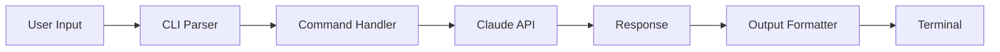
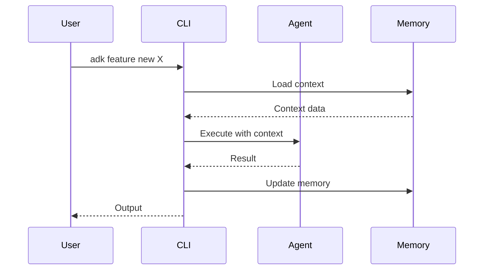

# Discovery: Tecnicas Avancadas para ADK

Documento de discovery com analise de mercado, gaps identificados e propostas de evolucao.

**Data:** 2026-01-20
**Status:** Em Analise

---

## Indice

1. [Resumo Executivo](#1-resumo-executivo)
2. [Estado Atual do ADK](#2-estado-atual-do-adk)
3. [Analise de Concorrentes 2026](#3-analise-de-concorrentes-2026)
4. [Gaps Identificados](#4-gaps-identificados)
5. [MCP Memory Server com Vector RAG](#5-mcp-memory-server-com-vector-rag)
6. [Subagentes Especializados](#6-subagentes-especializados)
7. [Documentacao Auto-gerada](#7-documentacao-auto-gerada)
8. [Constitution e Steering](#8-constitution-e-steering)
9. [Roadmap de Evolucao](#9-roadmap-de-evolucao)
10. [Referencias](#10-referencias)

---

## 1. Resumo Executivo

### Tendencias 2026 em Development Tooling

1. **Spec-Driven Development** e o antidoto para "vibe coding" caotico
2. **Multi-Agent Parallel Execution** com worktree isolation e padrao
3. **Agent Steering** (contexto persistente) supera context windows
4. **MCP** como protocolo padrao para integracao de ferramentas
5. **Vector RAG** para memoria semantica sem compactacao

### Principais Gaps no ADK

| Area | Gap | Impacto |
|------|-----|---------|
| Memoria | Busca por keywords, nao semantica | Alto |
| Subagentes | Nao sao invocados automaticamente | Alto |
| Documentacao | Falta geracao automatica | Medio |
| MCP | Nenhuma integracao ativa | Alto |

---

## 2. Estado Atual do ADK

### Features Implementadas vs Planejadas

| Feature | Status | Observacao |
|---------|--------|------------|
| CLI Enhancement (sync/restore/history/status) | ✅ 100% | Totalmente implementado |
| Parallel Agent Execution | ✅ 100% | Worktree isolation funcionando |
| MCP Integration | ❌ 0% | Infraestrutura pronta, nao conectada |
| Extended Thinking | ❌ 0% | Model router existe, nao integrado |
| Spec-Driven Development | ⚠️ 20% | spec-utils.ts existe, workflow incompleto |
| Vector RAG Memory | ❌ 0% | Busca atual e por keywords simples |
| Subagentes Automaticos | ⚠️ 30% | Agentes existem, delegacao manual |

### Sistema de Memoria Atual

| Componente | Arquivo | Estado | Problema |
|------------|---------|--------|----------|
| Busca | `memory-search.ts` | ⚠️ | Match literal de palavras, nao semantico |
| Hierarquia | `tiered-memory.ts` | ✅ | Project→Feature→Phase→Session funciona |
| Contexto | `dynamic-context.ts` | ⚠️ | Keywords + stop words, sem embeddings |
| Compressao | `memory-compression.ts` | ⚠️ | Objetivo e indexar, NAO compactar |

**Problema Central:** A funcao `simpleSearch` faz match de palavras literais. Se voce escreve "autenticacao" na memoria e busca "auth", nao encontra.

### Agentes Existentes

```
.claude/agents/
├── analyzer.md          # Analise de codigo
├── architect.md         # Arquitetura
├── documenter.md        # Documentacao
├── implementer.md       # Implementacao TDD ✅
├── reviewer.md          # Code review ✅
├── reviewer-secondary.md # AI-on-AI review ✅
├── prd-creator.md       # Criacao de PRD ✅
├── task-breakdown.md    # Quebra de tasks ✅
└── tester.md            # Testes
```

**Problema:** Esses agentes existem mas nao sao invocados automaticamente no workflow.

---

## 3. Analise de Concorrentes 2026

### 3.1 GitHub Spec Kit

**Site:** https://github.com/github/spec-kit

**Features Chave:**
- **Constitution** (`memory/constitution.md`) - Principios imutaveis do projeto
- **Workflow linear:** `/speckit.specify` → `/speckit.plan` → `/speckit.tasks`
- **Agent-agnostic** - Funciona com Claude, Copilot, Cursor, Gemini
- **Checklists automaticas** para validacao constitucional
- **CLI Specify** - Python-based com templates

**Como Funciona:**
```
1. /speckit.constitution  → Define principios do projeto
2. /speckit.specify       → Descreve o que construir (what/why)
3. /speckit.plan          → Cria plano respeitando constitution
4. /speckit.tasks         → Quebra em tasks ordenadas
```

**Gap no ADK:** Nao temos "Constitution" como conceito first-class.

---

### 3.2 Kiro (AWS)

**Site:** https://kiro.dev/

**Features Chave:**
- **Agent Steering** - Diretorio `.kiro/steering/`:
  - `product.md` - Visao do produto, features, usuarios
  - `structure.md` - Estrutura do projeto
  - `tech.md` - Stack tecnologico
- **Agent Hooks** - Automacoes event-driven:
  - Salvar componente → atualiza testes
  - Modificar API → atualiza README
  - Pre-commit → scan de credenciais
- **Spec-Driven Workflow** - User stories → Technical design → Tasks

**Como Funciona:**
```bash
# Setup inicial
Kiro: Setup Steering for Project

# Steering files criados automaticamente
.kiro/steering/
├── product.md    # Visao do produto
├── structure.md  # Estrutura do projeto
└── tech.md       # Stack tecnologico
```

**Gap no ADK:** Hooks mais primitivos, sem steering files estruturados.

---

### 3.3 Amazon Q Developer

**Site:** https://aws.amazon.com/q/developer/

**Features Chave:**
- `/dev` - Implementa features multi-arquivo
- `/doc` - Gera documentacao + diagramas de data flow
- `/review` - Code review automatizado com findings
- `/test` - Gera unit tests com coverage
- `/transform` - Upgrade de codigo legado
- **CLI Agent** - Acesso a file system local

**Como Funciona:**
```bash
# No chat do IDE
/dev "Add user authentication with JWT"
# → Q Developer cria multiplos arquivos, testes, etc.

/doc
# → Gera README, diagramas, docstrings

/review
# → Lista findings por severidade
```

**Gap no ADK:** Nossos agentes sao genericos, falta especializacao por tarefa.

---

### 3.4 Cursor 2.0

**Site:** https://cursor.com/blog/2-0

**Features Chave:**
- **8 agentes em paralelo** com worktree isolation
- **Composer model** - 4x mais rapido, otimizado para codigo
- **Semantic search** - Indexacao completa do codebase
- **Plan Mode** - Criar plano com um modelo, executar com outro
- **Multi-file refactoring** - Toca dezenas de arquivos de uma vez

**Como Funciona:**
```
1. Composer indexa todo o codebase (embeddings)
2. Query semantica encontra codigo relevante
3. Ate 8 agentes trabalham em paralelo
4. Cada agente em worktree isolada
5. Merge automatico com deteccao de conflitos
```

**Parcialmente no ADK:** Temos parallel execution mas sem semantic search.

---

### 3.5 MCP Ecosystem

**Site:** https://modelcontextprotocol.io/

**Features Maduras:**
- `tools/list` endpoint para discovery
- OAuth 2.0 para autenticacao
- Enterprise Gateway para governanca
- Registry centralizado (em desenvolvimento)

**MCPs de Memoria Disponiveis:**

| MCP Server | Features | Link |
|------------|----------|------|
| rag-memory-mcp | SQLite-vec + Knowledge Graph + Embeddings | https://github.com/ttommyth/rag-memory-mcp |
| RAG Context MCP | Vectra + SQLite | https://glama.ai/mcp/servers/@notbnull/mcp-rag-context |
| RAG Memory PostgreSQL | Supabase + HuggingFace | https://lobehub.com/mcp/kshidenko-rag-memory-pg-mcp |
| MindsDB MCP | Pinecone/Weaviate/Qdrant | https://mindsdb.com/unified-model-context-protocol-mcp-server-for-vector-stores |

**Gap no ADK:** Nao usamos MCP para nada ainda.

---

## 4. Gaps Identificados

### 4.1 Memoria Semantica

**Problema Atual:**
```typescript
// memory-search.ts - Busca por palavras literais
function simpleSearch(text: string, query: string): number {
  const words = lowerQuery.split(/\s+/)
  for (const word of words) {
    if (lowerText.includes(word)) {
      matches++
    }
  }
  return matches / words.length
}
```

**Resultado:** "autenticacao" na memoria + busca "auth" = NAO ENCONTRA

**Solucao:** Vector embeddings + busca semantica via MCP

---

### 4.2 Delegacao Automatica de Subagentes

**Problema Atual:**
- Agentes existem em `.claude/agents/`
- NAO sao invocados automaticamente pelo workflow
- Usuario precisa chamar manualmente

**Solucao:** Orchestrator pattern com Task tool

---

### 4.3 Documentacao Tecnica

**Problema Atual:**
- Nenhuma geracao automatica de docs
- Diagramas criados manualmente
- Docs desatualizados rapidamente

**Solucao:** Comando `/doc` com geracao de Mermaid

---

### 4.4 Contexto Persistente (Steering)

**Problema Atual:**
- `project-context.md` mistura muita informacao
- Nao ha separacao clara de concerns
- Context window limitado

**Solucao:** Steering files separados + indexacao RAG

---

## 5. MCP Memory Server com Vector RAG

Sistema de memoria semantica que **indexa sem compactar**, permitindo recall focado "conta-gotas".

### 5.1 Arquitetura Proposta

```
┌─────────────────────────────────────────────────────────────┐
│                     ADK CLI                                  │
├─────────────────────────────────────────────────────────────┤
│                                                              │
│  ┌─────────────┐    ┌─────────────┐    ┌─────────────┐     │
│  │   Memory    │    │   Context   │    │   Agent     │     │
│  │   Commands  │    │   Injection │    │   Dispatch  │     │
│  └──────┬──────┘    └──────┬──────┘    └──────┬──────┘     │
│         │                  │                  │              │
│         └──────────────────┼──────────────────┘              │
│                            │                                 │
│                            ▼                                 │
│              ┌─────────────────────────┐                    │
│              │    MCP Memory Server    │ ◀── via mcp.json   │
│              │  (rag-memory-mcp)       │                    │
│              └───────────┬─────────────┘                    │
│                          │                                   │
│         ┌────────────────┼────────────────┐                 │
│         ▼                ▼                ▼                 │
│  ┌──────────┐    ┌──────────┐    ┌──────────┐              │
│  │ SQLite   │    │ Sentence │    │ Knowledge│              │
│  │ + Vec    │    │ Transform│    │  Graph   │              │
│  └──────────┘    └──────────┘    └──────────┘              │
└─────────────────────────────────────────────────────────────┘
```

### 5.2 Comandos CLI Propostos

```bash
# Indexacao (nunca compacta, apenas indexa)
adk memory index                      # Indexa toda .claude/
adk memory index --feature <name>     # Indexa feature especifica

# Recall focado (conta-gotas)
adk memory recall "autenticacao JWT"  # Busca semantica
adk memory recall --top 3             # Retorna top 3 chunks relevantes

# Injecao automatica
adk context inject                    # Injeta contexto relevante no prompt
```

### 5.3 Configuracao `.adk/memory.json`

```json
{
  "provider": "rag-memory-mcp",
  "embedding": {
    "model": "sentence-transformers/all-MiniLM-L6-v2",
    "chunkSize": 500,
    "overlap": 50
  },
  "storage": {
    "type": "sqlite-vec",
    "path": ".adk/memory.db"
  },
  "retrieval": {
    "topK": 5,
    "threshold": 0.7,
    "rerank": true
  },
  "neverCompact": true
}
```

### 5.4 Integracao com Claude Code

Adicionar ao `.claude/mcp.json`:

```json
{
  "mcpServers": {
    "rag-memory": {
      "command": "npx",
      "args": ["-y", "rag-memory-mcp"],
      "env": {
        "STORAGE_PATH": ".adk/memory.db"
      }
    }
  }
}
```

### 5.5 Fluxo de Indexacao

```
1. Usuario cria/atualiza arquivo em .claude/
           │
           ▼
2. Hook detecta mudanca (post-write)
           │
           ▼
3. Arquivo e chunked (500 tokens, 50 overlap)
           │
           ▼
4. Chunks sao embedded (sentence-transformers)
           │
           ▼
5. Embeddings salvos no SQLite-vec
           │
           ▼
6. Knowledge graph atualizado (entidades/relacoes)
```

### 5.6 Fluxo de Recall (Conta-Gotas)

```
1. Agente precisa de contexto
           │
           ▼
2. Query e embedded
           │
           ▼
3. Busca semantica no SQLite-vec
           │
           ▼
4. Top K chunks retornados
           │
           ▼
5. Reranking por relevancia
           │
           ▼
6. Contexto injetado no prompt (focado)
```

### 5.7 Vantagens sobre Sistema Atual

| Aspecto | Atual | Proposto |
|---------|-------|----------|
| Busca | Keywords literais | Semantica |
| "auth" encontra "autenticacao" | ❌ | ✅ |
| Contexto | Arquivo inteiro | Chunks relevantes |
| Compactacao | Perde informacao | Nunca compacta |
| Persistencia | Arquivos MD | SQLite + embeddings |

---

## 6. Subagentes Especializados

Sistema de delegacao automatica para agentes hiper-focados.

### 6.1 Padrao Orchestrator → Specialists

```
┌──────────────────────────────────────────────────────────────┐
│                    /new-feature workflow                      │
├──────────────────────────────────────────────────────────────┤
│                                                               │
│  ┌─────────────────────────────────────────────────────────┐ │
│  │              ORCHESTRATOR (main Claude)                  │ │
│  │  - Decide qual agente invocar                           │ │
│  │  - Passa contexto especifico via Memory MCP             │ │
│  │  - Recebe resultado e avanca                            │ │
│  └──────────────────────────┬──────────────────────────────┘ │
│                             │                                 │
│     ┌───────────┬───────────┼───────────┬───────────┐        │
│     ▼           ▼           ▼           ▼           ▼        │
│ ┌────────┐ ┌────────┐ ┌────────┐ ┌────────┐ ┌────────┐      │
│ │research│ │   prd  │ │  task  │ │implement│ │   qa   │      │
│ │-agent  │ │-creator│ │-break  │ │  -er   │ │-agent  │      │
│ └────────┘ └────────┘ └────────┘ └────────┘ └────────┘      │
│                                                               │
│  Cada um com:                                                │
│  - Tools especificas (Read-only vs Write)                    │
│  - Model especifico (haiku vs opus)                          │
│  - Prompt especializado                                       │
│  - Contexto injetado via Memory MCP                          │
└──────────────────────────────────────────────────────────────┘
```

### 6.2 Configuracao de Tools por Tipo

| Tipo de Agente | Tools | Model | Uso |
|----------------|-------|-------|-----|
| Read-only reviewers | Read, Grep, Glob, LS | haiku | Analise rapida |
| File creators | Read, Write, Edit, Glob, Grep | sonnet | Criacao de codigo |
| Script runners | Read, Write, Edit, Glob, Grep, Bash | sonnet | Execucao de comandos |
| Research agents | Read, Grep, Glob, WebFetch, WebSearch | sonnet | Pesquisa |
| Orchestrators | Read, Grep, Glob, Task | opus | Coordenacao |

### 6.3 Novos Agentes Propostos

#### research-agent.md

```yaml
---
name: research-agent
description: Pesquisa codebase e tecnologias antes de implementar
tools:
  - Read
  - Grep
  - Glob
  - WebSearch
  - WebFetch
model: sonnet
context_injection: auto
---

# Research Agent

Voce e um pesquisador senior especializado em analise de codigo e tecnologias.

## Workflow

1. Analise o codebase para entender padroes existentes
2. Pesquise documentacao de bibliotecas relevantes
3. Identifique riscos e dependencias
4. Produza relatorio estruturado

## Output

- research.md com findings
- Lista de arquivos a modificar
- Riscos identificados
```

#### doc-generator.md

```yaml
---
name: doc-generator
description: Gera documentacao tecnica com diagramas Mermaid
tools:
  - Read
  - Write
  - Glob
model: haiku
output_format: markdown+mermaid
---

# Documentation Generator

Voce e um technical writer especializado em documentacao de software.

## Workflow

1. Leia codigo fonte e testes
2. Extraia estrutura e fluxos
3. Gere diagramas Mermaid
4. Escreva documentacao clara

## Output Formats

- README.md
- API docs
- Diagramas de fluxo
- Diagramas de sequencia
```

#### test-generator.md

```yaml
---
name: test-generator
description: Gera testes baseado em specs e codigo existente
tools:
  - Read
  - Write
  - Grep
  - Glob
  - Bash
model: sonnet
coverage_target: 80%
---

# Test Generator

Voce e um QA engineer especializado em testes automatizados.

## Workflow

1. Leia spec da feature
2. Analise codigo implementado
3. Gere testes unitarios
4. Gere testes de integracao
5. Verifique coverage

## Regras

- Coverage minimo: 80%
- Testes devem ser deterministicos
- Mocks apenas para dependencias externas
```

#### security-scanner.md

```yaml
---
name: security-scanner
description: Analisa codigo por vulnerabilidades OWASP
tools:
  - Read
  - Grep
  - Glob
model: sonnet
scan_type: owasp-top-10
---

# Security Scanner

Voce e um security engineer especializado em OWASP Top 10.

## Checklist

- [ ] SQL Injection
- [ ] XSS
- [ ] Broken Authentication
- [ ] Sensitive Data Exposure
- [ ] Security Misconfiguration
- [ ] Insecure Deserialization

## Output

- security-report.md
- Lista de vulnerabilidades por severidade
- Recomendacoes de fix
```

### 6.4 Delegacao Automatica via Workflow

```typescript
async function implementFeature(name: string) {
  // 1. Orchestrator busca contexto semantico
  const context = await memoryMcp.recall(name, { topK: 5 })

  // 2. Delega para research-agent
  const research = await claudeTask({
    agent: 'research-agent',
    context: context,
    instruction: `Pesquise o codebase para implementar ${name}`
  })

  // 3. Delega para implementer
  await claudeTask({
    agent: 'implementer',
    context: [...context, research],
    instruction: `Implemente seguindo TDD`
  })

  // 4. Delega para test-generator
  await claudeTask({
    agent: 'test-generator',
    context: context,
    instruction: `Gere testes para coverage >= 80%`
  })

  // 5. Delega para security-scanner
  await claudeTask({
    agent: 'security-scanner',
    instruction: `Scan de vulnerabilidades OWASP`
  })
}
```

### 6.5 Best Practices (Claude Code Docs)

1. **Batch size:** 5-8 items por agente
2. **Paralelo:** 2-4 agentes simultaneamente
3. **Profundidade:** Maximo 2 niveis de orquestracao
4. **Contexto limpo:** Subagentes mantem contexto principal limpo

**O "Handoff Problem":** Subagentes comecam com contexto vazio. Sempre fornecer:
- Objetivo especifico
- Arquivos relevantes
- Constraints do projeto
- Output esperado

---

## 7. Documentacao Auto-gerada

Sistema de geracao automatica de documentacao tecnica.

### 7.1 Estrutura de Docs

```
.claude/docs/
├── architecture/
│   ├── overview.md           # Auto-gerado do codebase
│   ├── data-flow.mermaid     # Diagramas gerados
│   └── components.md         # Mapa de componentes
├── api/
│   ├── commands.md           # Gerado do src/commands/
│   └── utils.md              # Gerado do src/utils/
└── decisions/
    └── *.md                  # ADRs (ja existe)
```

### 7.2 Comando `/doc`

```bash
adk doc generate               # Gera docs do codebase
adk doc generate --feature X   # Docs da feature X
adk doc diagram --type flow    # Gera diagrama de fluxo
adk doc diagram --type arch    # Gera diagrama de arquitetura
adk doc diagram --type seq     # Gera diagrama de sequencia
```

### 7.3 Templates de Diagrama

#### Data Flow



#### Sequence



### 7.4 Integracao com Workflow

Apos cada fase, documentacao e atualizada automaticamente:

```bash
adk feature implement X
# → Hook dispara: adk doc generate --feature X
```

---

## 8. Constitution e Steering

Sistema de contexto persistente inspirado em Spec Kit e Kiro.

### 8.1 Constitution (Principios Imutaveis)

```
.claude/constitution/
├── principles.md      # Principios imutaveis do projeto
├── architecture.md    # Decisoes arquiteturais
├── security.md        # Regras de seguranca
└── quality.md         # Padroes de qualidade
```

**Exemplo `principles.md`:**

```markdown
# Constitution: Principios do Projeto

## Imutaveis

1. **TDD Obrigatorio** - Nenhum codigo sem teste primeiro
2. **Security First** - OWASP Top 10 sempre validado
3. **Clean Architecture** - Camadas bem definidas
4. **No Magic** - Codigo explicito, sem convencoes ocultas

## Validacao

Toda feature deve passar por:
- [ ] Compliance check contra principles
- [ ] Review de architecture.md
- [ ] Scan de security.md
```

### 8.2 Steering (Contexto Persistente)

```
.claude/steering/
├── product.md         # Visao, features, usuarios-alvo
├── structure.md       # Mapa do codebase
├── tech.md            # Stack e convencoes
└── patterns.md        # Padroes aprovados
```

**Exemplo `product.md`:**

```markdown
# Product: ADK

## Visao

CLI toolkit para desenvolvimento AI-assistido.

## Usuarios

- Desenvolvedores individuais
- Equipes pequenas (2-5 pessoas)
- Projetos greenfield e brownfield

## Features Principais

1. Feature lifecycle management
2. Automated workflows
3. Quality gates
4. Memory persistence
```

### 8.3 Comando de Validacao

```bash
adk validate <feature>       # Valida contra constitution
adk validate --pre-commit    # Hook de validacao
```

---

## 9. Roadmap de Evolucao

### Fase 1: Memory MCP (1-2 semanas)

**Objetivo:** Memoria semantica sem compactacao

**Tasks:**
1. Integrar rag-memory-mcp via `.claude/mcp.json`
2. Criar `adk memory index` e `adk memory recall`
3. Hook de injecao automatica no `inject-focus.sh`
4. Testes de busca semantica vs keyword

**Entregaveis:**
- `.adk/memory.db` com embeddings
- Comandos CLI funcionando
- Documentacao de uso

---

### Fase 2: Subagentes Especializados (1-2 semanas)

**Objetivo:** Delegacao automatica para agentes focados

**Tasks:**
1. Refatorar agentes existentes com tools especificas
2. Criar `research-agent`, `doc-generator`, `test-generator`, `security-scanner`
3. Implementar delegacao automatica no workflow
4. Testes de orquestracao

**Entregaveis:**
- 4 novos agentes especializados
- Workflow com delegacao automatica
- Metricas de qualidade por agente

---

### Fase 3: Auto-Doc (1 semana)

**Objetivo:** Documentacao tecnica gerada automaticamente

**Tasks:**
1. Criar comando `/doc`
2. Integrar geracao de Mermaid diagrams
3. Template de documentacao de features
4. Hook pos-implementacao

**Entregaveis:**
- Comando `adk doc generate`
- Diagramas automaticos
- Docs de feature atualizados

---

### Fase 4: Constitution e Steering (1 semana)

**Objetivo:** Contexto persistente estruturado

**Tasks:**
1. Criar estrutura `.claude/constitution/`
2. Criar estrutura `.claude/steering/`
3. Comando `adk validate`
4. Hook de validacao pre-commit

**Entregaveis:**
- Templates de constitution
- Templates de steering
- Validacao automatica

---

### Fase 5: Orquestracao Avancada (2 semanas)

**Objetivo:** Workflow completamente autonomo

**Tasks:**
1. Workflow que encadeia agentes automaticamente
2. Paralelizacao de agentes independentes
3. Handoff de contexto entre agentes
4. Metricas e observabilidade

**Entregaveis:**
- Pipeline automatico completo
- Dashboard de status de agentes
- Logs estruturados

---

## 10. Referencias

### Spec-Driven Development
- https://github.com/github/spec-kit
- https://github.blog/ai-and-ml/generative-ai/spec-driven-development-with-ai-get-started-with-a-new-open-source-toolkit/
- https://developer.microsoft.com/blog/spec-driven-development-spec-kit

### AI Coding Landscape
- https://www.faros.ai/blog/best-ai-coding-agents-2026
- https://www.nucamp.co/blog/top-10-vibe-coding-tools-in-2026-cursor-copilot-claude-code-more
- https://www.digitalocean.com/resources/articles/github-copilot-vs-cursor

### Cursor & Multi-Agent
- https://cursor.com/blog/2-0
- https://www.infoq.com/news/2025/11/cursor-composer-multiagent/

### Amazon Q Developer & Kiro
- https://aws.amazon.com/blogs/aws/new-amazon-q-developer-agent-capabilities-include-generating-documentation-code-reviews-and-unit-tests/
- https://kiro.dev/blog/introducing-kiro/
- https://www.infoq.com/news/2025/08/aws-kiro-spec-driven-agent/

### MCP Protocol
- https://modelcontextprotocol.io/specification/2025-11-25
- https://mcp-best-practice.github.io/mcp-best-practice/best-practice/
- https://www.anthropic.com/news/model-context-protocol

### MCP Memory/RAG
- https://github.com/ttommyth/rag-memory-mcp
- https://www.getknit.dev/blog/powering-rag-and-agent-memory-with-mcp
- https://becomingahacker.org/integrating-agentic-rag-with-mcp-servers-technical-implementation-guide-1aba8fd4e442

### Claude Code Subagents
- https://code.claude.com/docs/en/sub-agents
- https://dev.to/letanure/claude-code-part-6-subagents-and-task-delegation-k6f
- https://github.com/VoltAgent/awesome-claude-code-subagents
- https://www.eesel.ai/blog/subagents-in-claude-code

### Vibe Coding Best Practices
- https://www.softr.io/blog/vibe-coding-best-practices
- https://blog.gitguardian.com/automated-guard-rails-for-vibe-coding/
- https://addyosmani.com/blog/ai-coding-workflow/
